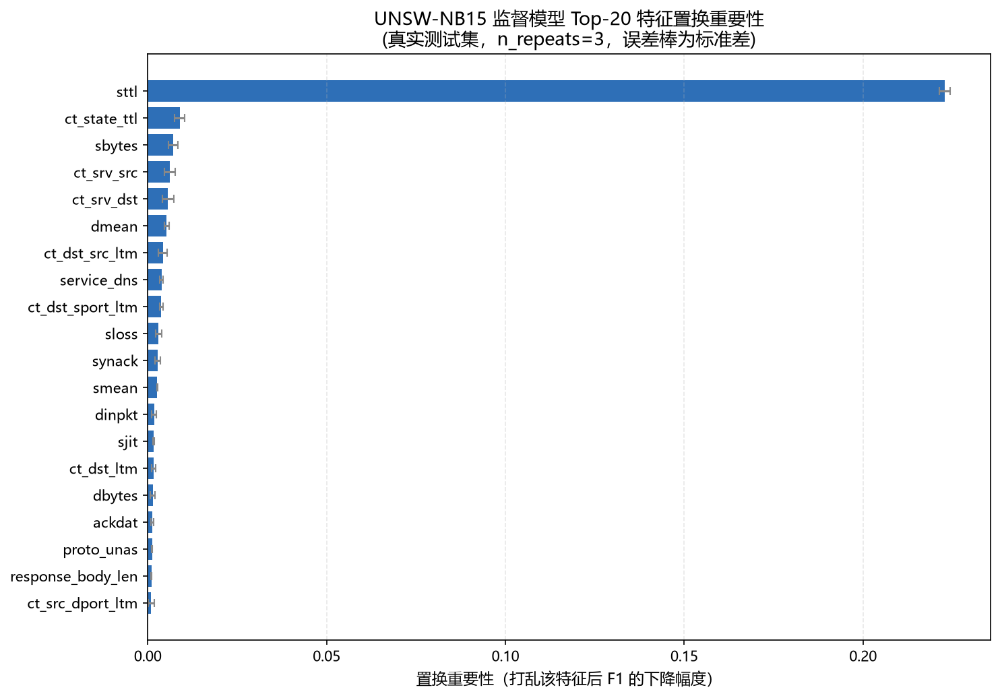
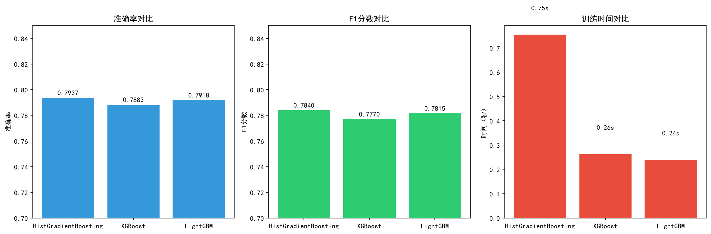
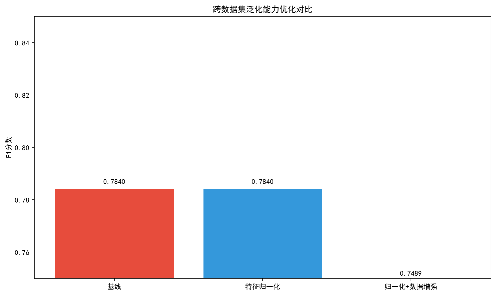
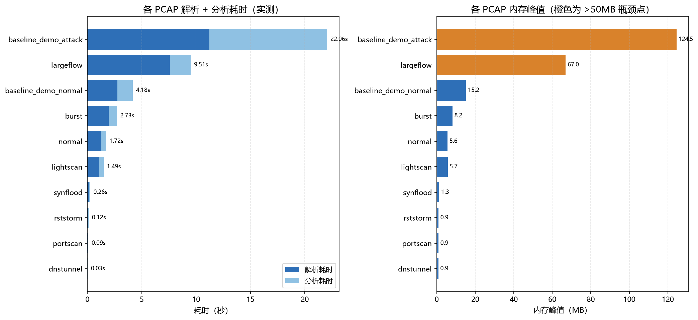
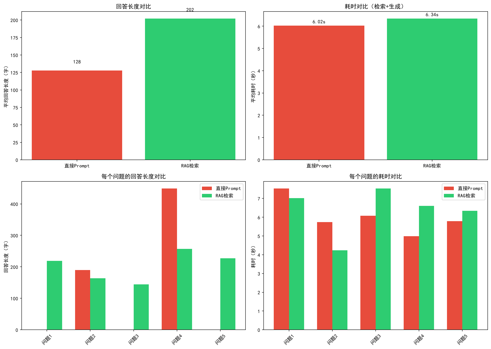
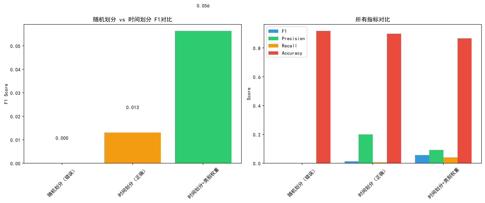

# AI Network Security Analyzer | AI 网络安全分析系统

> **中文**：AI 辅助的网络取证分析系统 — PCAP 离线分析 + 四引擎集成检测 + LLM 威胁研判 + RAG 安全知识问答
>
> **English**: AI-Assisted Network Forensics System — PCAP Offline Analysis + Four-Engine Integrated Detection + LLM Threat Assessment + RAG Security Knowledge Q&A

[](https://www.python.org/)
[](https://fastapi.tiangolo.com/)
[](https://www.gradio.app/)
[](LICENSE)
[](#测试)

**[中文版](#目录) | [English Version](README_EN.md)**

---

## 目录

- [项目简介](#项目简介)
- [核心特性](#核心特性)
- [技术架构](#技术架构)
- [快速开始](#快速开始)
- [使用指南](#使用指南)
- [API 文档](#api-文档)
- [评测结果](#评测结果)
- [项目结构](#项目结构)
- [开发指南](#开发指南)
- [更新日志](#更新日志)
- [常见问题](#常见问题)
- [许可证](#许可证)

---

## 项目简介

传统网络取证分析依赖安全分析师用 Wireshark 逐包查看 PCAP 文件，效率极低且高度依赖个人经验。规则引擎虽然能自动化检测，但对未知攻击和大流量变种漏报严重（UNSW-NB15 大流量类 Recall 仅 0.002）。

本项目是一个 **AI 辅助的离线网络取证分析工具**，实现了：
- **四引擎集成检测**：监督模型（HistGradientBoosting）为主引擎 + 规则引擎 + EWMA 时序基线 + 孤立森林，加权投票降低误报漏报
- **LLM 威胁研判**：大模型将技术告警翻译为人类可读的威胁分析，配套幻觉控制三件套
- **RAG 安全知识问答**：本地向量库（BGE ONNX + ChromaDB），混合检索 + 重排序
- **全流程闭环**：检测 → 分析 → 取证报告（五要素）→ 历史知识库（跨样本关联/趋势分析）

### 为什么选择这个项目

| 维度 | 说明 |
|------|------|
| **算法深度** | 76 维 CICFlowMeter 特征提取、四引擎集成投票、自适应阈值、STL 时序分解 |
| **AI 工程** | 幻觉控制三件套、RAG 混合检索+重排序、本地向量推理 |
| **工程质量** | 141 单元测试、FastAPI + Pydantic、SQLite WAL、DPAPI 加密、全局异常处理 |
| **轻量可移植** | 平均内存峰值 23MB、本地推理不依赖外部服务、Windows .exe 打包 |
| **可验证** | 所有指标都有评测脚本和结果文件，不是"拍脑袋" |

---

## 核心特性

### 🔍 四引擎集成检测

| 引擎 | 类型 | 权重 | 说明 |
|------|------|------|------|
| **监督模型** | HistGradientBoosting | 0.5 | 76 维 CICFlowMeter 特征，流级预测+PCAP 级聚合，F1=0.9487 |
| **规则引擎** | 阈值规则 | 0.2 | 10+ 可配置规则（SYN 洪水/端口扫描/DNS 隧道/RST 风暴等） |
| **时序基线** | EWMA + 中位数/MAD | 0.15 | 4 维度联合检测，多维度同时偏差触发 CRITICAL |
| **孤立森林** | 无监督异常检测 | 0.15 | 低维表格数据适合，检测未知异常 |

- **自适应阈值**：基于输入流量 P95 分位数动态调整，适应不同网络环境
- **STL 高级模式**：零依赖轻量级时序分解（趋势+季节性+残差），捕捉周期性偏离
- **策略模式架构**：可扩展，新增检测算法只需实现接口并注册

### 🤖 LLM 威胁研判 + 幻觉控制

- **威胁分析**：大模型自动生成威胁分析报告，跨告警关联，攻击链还原
- **幻觉控制三件套**：
  - `OutputValidator`：格式/长度/合理性/与证据一致性/幻觉特征词检测
  - `ConfidenceCrossValidator`：LLM vs 规则 vs 监督模型交叉验证，矛盾检测
  - `ReviewMarker`：低置信度/矛盾结论自动标记"需人工复核"
- **思考过程可视化**：显示 LLM 分析和思考过程
- **多模型兼容**：智谱/DeepSeek/OpenAI 兼容接口

### 📚 RAG 安全知识问答

- **本地向量库**：ChromaDB + BGE ONNX 推理（2804 条知识片段，零外部服务依赖）
- **混合检索**：BM25 关键词 + 向量语义，双通道召回
- **轻量级重排序**：标题 0.4 + 内容 0.3 + 元数据 0.2 + 向量距离 0.1 + 精确匹配加分
- **安全术语同义词扩展**：10 类中文→英文，提升跨语言检索效果
- **攻击类型知识库**：5 篇专业文档（SQL注入/勒索软件/钓鱼/内存马/中间人攻击），已导入向量库
- **对话历史持久化**：SQLite 存储，刷新不丢失
- **RAG 评测**：15 题黄金问答集，Recall@5=0.680

### 📋 取证报告五要素

1. **事件时间线**：告警时间轴，严重度颜色标记
2. **ATT&CK 攻击链图**：SVG 7 阶段杀伤链，检测到的阶段红色高亮
3. **IOC 失陷指标列表**：IP/端口/关联告警
4. **证据链**：告警 → 证据 → 检测引擎 → 时间窗口
5. **分析师备注**：虚线框预留填写区域

### 🧠 取证知识库

- **跨样本关联分析**：相同攻击类型/相似告警/时间相近打分，发现攻击模式演变
- **趋势分析**：按日统计/攻击类型分布/严重度趋势/主引擎判定趋势
- **重复检测缓存**：基于文件 SHA256，相同文件直接返回历史结果
- **IOC 提取**：从分析记录自动提取 IP/端口等失陷指标

### 📂 历史记录报告管理

- **确认重新分析机制**：报告文件被删除时，显示确认区域询问用户是否重新执行PCAP分析，避免误操作
- **3阶段进度条**：确认后分阶段显示进度（解析PCAP+特征提取→生成报告→打开报告），用户可实时了解分析状态
- **后台独立执行**：重新分析在后台独立执行完整PCAP分析（含AI研判），不影响Tab1的PCAP分析页面操作，支持多任务并行
- **PCAP文件持久化**：分析完成后自动将PCAP文件复制到 `data/samples/analyzed/` 目录（时间戳前缀），确保重新分析时源文件一定存在，即使原始文件被删除
- **旧记录自动搜索**：对于v2.0.0之前没有 `file_path` 字段的旧记录，自动在 `data/samples/`、桌面、下载目录搜索同名PCAP文件，搜索到后自动更新历史记录
- **一一映射去重**：相同PCAP反复分析使用基于SHA256的固定文件名，覆盖旧报告，避免 `data/reports/` 目录堆积大量重复文件
- **精确记录选择**：下拉框精确选择历史记录（记录ID匹配），避免表格点击状态不同步导致打开错误报告

### 🔒 安全与工程化

- **API Key 安全存储**：Windows DPAPI 加密（ctypes 调用，零额外依赖），绑定当前用户
- **图形化配置向导**：首次启动引导配置，API Key 有效性校验
- **全局异常处理**：10+ 异常类型友好中文提示，用户永远看不到 Python 堆栈
- **日志可观测性**：日志查看器 API（级别/关键词过滤）+ 一键诊断报告（7 大维度）
- **输入校验**：PCAP 文件/API Key/Base URL/基线名称全面校验
- **优雅降级**：LLM 失败→规则引擎摘要，RAG 失败→关键词匹配

---

## 技术架构

### 分层架构（v3.0.0 激进重构）

```
┌─────────────────────────────────────────────────────────────────┐
│                        桌面窗口（pywebview）                       │
│              Gradio UI + 自定义 HTML/CSS（蓝色二次元风格）         │
└──────────────────────────────┬──────────────────────────────────┘
                               │ HTTP (localhost:8080)
┌──────────────────────────────▼──────────────────────────────────┐
│                      FastAPI 后端服务                              │
│         Pydantic Settings │ 全局中间件 │ 统一异常处理              │
└─────────────────────────────────────────────────────────────────┘
                               │
┌──────────────────────────────▼──────────────────────────────────┐
│                        路由层（src/api/routes/）                   │
│  analyze.py │ baseline.py │ knowledge.py │ chat.py │ system.py │
└──────────────────────────────┬──────────────────────────────────┘
                               │
┌──────────────────────────────▼──────────────────────────────────┐
│                        服务层（src/services/）                     │
│  analysis_service │ baseline_service │ knowledge_service          │
│  report_service │ history_service                                │
└──────────────────────────────┬──────────────────────────────────┘
                               │
┌──────────────────────────────▼──────────────────────────────────┐
│                        核心层（src/core/）                        │
│  errors.py（30个错误码）│ exceptions.py（8大类异常）│ middleware.py │
└──────────────────────────────┬──────────────────────────────────┘
                               │
┌──────────┬──────────┬──────────┬──────────┬─────────────────────┘
▼          ▼          ▼          ▼          ▼
解析层     检测层     AI 层     存储层     安全层
Scapy     四引擎     LLM       SQLite    DPAPI
流式解析   集成投票   +RAG      WAL       加密存储
```

### 架构分层说明

| 层级 | 目录 | 职责 | 特点 |
|------|------|------|------|
| **核心层** | `src/core/` | 异常体系、错误码、中间件 | 基础设施，不依赖业务 |
| **服务层** | `src/services/` | 业务逻辑实现 | 单例模式，可独立测试 |
| **路由层** | `src/api/routes/` | API路由定义 | 参数校验，调用服务 |
| **配置层** | `config/settings.py` | 集中配置管理 | Pydantic，按功能分组 |

### 原架构

```
┌─────────────────────────────────────────────────────────────────┐
│                        桌面窗口（pywebview）                       │
│              Gradio UI + 自定义 HTML/CSS（蓝色二次元风格）         │
└──────────────────────────────┬──────────────────────────────────┘
                               │ HTTP (localhost:8080)
┌──────────────────────────────▼──────────────────────────────────┐
│                      FastAPI 后端服务                              │
│         Pydantic 20+ 模型 │ 全局异常处理 │ 日志可观测性            │
└──────┬──────────┬──────────┬──────────┬──────────┬─────────────┘
       │          │          │          │          │
┌──────▼───┐ ┌───▼────┐ ┌──▼─────┐ ┌─▼──────┐ ┌▼────────────┐
│  解析层   │ │ 检测层  │ │ AI 层  │ │ 存储层  │ │  安全层      │
│ Scapy    │ │ 四引擎  │ │ LLM    │ │ SQLite │ │  DPAPI      │
│ 流式解析  │ │ 集成投票│ │ +RAG   │ │ WAL    │ │  加密存储    │
└──────────┘ └────────┘ └────────┘ └────────┘ └─────────────┘
```

### 技术栈

| 层级 | 技术 | 版本 | 说明 |
|------|------|------|------|
| **语言** | Python | 3.11 | - |
| **后端** | FastAPI | 0.110+ | 异步 API，Pydantic 校验 |
| **前端** | Gradio | 6.x | 快速 UI，自定义 CSS |
| **桌面** | pywebview | 5.x | 原生窗口，系统 WebView |
| **解析** | Scapy | 2.5+ | PCAP 流式解析 |
| **算法** | scikit-learn | 1.3+ | HistGradientBoosting / IsolationForest |
| **AI** | 大模型 API | - | 智谱/DeepSeek/OpenAI 兼容 |
| **向量** | ChromaDB | 0.4+ | 本地向量库 |
| **嵌入** | BGE ONNX | - | 中文优化，本地推理 |
| **存储** | SQLite | 3.x | WAL 模式，三表+索引 |
| **安全** | DPAPI (ctypes) | - | Windows 内置加密 |
| **日志** | loguru | 0.7+ | 结构化日志 |
| **测试** | pytest | 7.x+ | 141 测试全绿 |

---

## 快速开始

### 环境要求

- Windows 10/11（推荐，DPAPI 加密需要）
- Python 3.11+
- 内存：最低 2GB，推荐 4GB+
- 磁盘：最低 500MB（含模型和依赖）

### 方式一：源码运行（推荐开发）

```bash
# 1. 克隆仓库
git clone https://github.com/your-username/ai-network-security-analyzer.git
cd ai-network-security-analyzer

# 2. 创建虚拟环境
python -m venv venv
venv\Scripts\activate

# 3. 安装依赖
pip install -r requirements.txt

# 4. 下载大文件资源（首次运行必须，约 140 MB）
# BGE 嵌入模型 + MITRE ATT&CK 知识库，因体积较大不包含在仓库中
python tools/init_resources.py

# 5. 配置 API Key（首次运行）
# 复制 .env.example 为 .env，填写 LLM_API_KEY
copy .env.example .env
# 编辑 .env，填写你的 API Key（也可以在 UI 设置中配置，会用 DPAPI 加密存储）

# 6. 启动桌面版
python desktop_app.py

# 或者启动 API 服务（浏览器访问 http://127.0.0.1:8080）
python -m uvicorn src.api.main:app --host 127.0.0.1 --port 8080
```

### 方式二：Windows 安装包（推荐用户）

1. 下载最新发布的 `AI-Network-Security-Analyzer-Setup.exe`
2. 双击运行安装程序，选择安装目录
3. 安装完成后，桌面快捷方式启动
4. 首次启动会引导配置 API Key（DPAPI 加密存储，不写死）

### 方式三：Docker 部署（服务器/跨平台推荐）

```bash
# 1. 克隆项目
git clone https://github.com/LJY20030728/ai-network-security-analyzer.git
cd ai-network-security-analyzer

# 2. 配置环境变量
cp .env.example .env
# 编辑 .env，填入你的 LLM_API_KEY

# 3. 构建并启动（推荐用 docker compose）
docker compose up -d --build

# 4. 访问服务
# 浏览器打开 http://localhost:8080
```

> 📖 完整 Docker 部署指南请查看 [docs/DOCKER_DEPLOYMENT.md](docs/DOCKER_DEPLOYMENT.md)（含环境变量配置、数据持久化、生产环境建议、故障排查）

---

## 使用指南

### 1. PCAP 流量分析

1. 打开应用，进入「📊 PCAP流量分析」Tab
2. 点击「选择文件」上传 .pcap/.pcapng 文件（最大 200MB）
3. （可选）选择已学习的时序基线进行对比检测
4. 点击「开始分析」
5. 查看结果：
   - **主引擎判定**：攻击/正常 + 置信度 + 攻击流比例 + 攻击类别
   - **告警列表**：四引擎检测到的所有告警，按严重度排序
   - **流量统计**：包数/流数/字节数/协议分布
   - **AI 威胁分析**：LLM 生成的威胁分析报告（含幻觉控制校验）
   - **取证报告**：点击下载五要素完整 HTML 报告

### 2. 基线管理

1. 进入「📈 基线管理」Tab
2. 点击「上传正常流量学习基线」，选择正常业务流量的 .pcap 文件
3. 输入基线名称，点击「学习」
4. 学习完成后可查看：
   - **基线画像**：4 维度（包数/字节/SYN/端口数）中位数±MAD 条形图（SVG）
   - **对比图**：当前流量 vs 基线中位数折线图（SVG）
5. 分析 PCAP 时可选择该基线进行对比检测

### 3. 安全问答助手

1. 进入「🤖 安全问答」Tab
2. 输入安全相关问题（如"什么是 SQL 注入？如何检测？"）
3. 系统从本地知识库检索相关文档，结合 LLM 生成回答
4. 对话历史自动保存，刷新不丢失
5. 可查看检索到的相关文档片段

### 4. 分析历史

1. 进入「📜 分析历史」Tab
2. 查看所有历史分析记录（文件/时间/告警数/严重度/主引擎判定）
3. 点击记录可查看详情、重新加载分析结果
4. 取证知识库功能：
   - **跨样本关联**：查看与当前样本相似的历史分析
   - **趋势分析**：攻击数量/类型/严重度随时间的变化趋势
   - **重复检测缓存**：相同文件（SHA256）直接返回历史结果

### 5. 设置

1. 进入「⚙️ 设置」Tab
2. 配置 API Key（密码输入框，保存后用 DPAPI 加密存储）
3. 配置 Base URL 和模型名称
4. 点击「测试连接」验证 API Key 有效性
5. 保存后立即生效，无需重启

---

## API 文档

启动服务后访问 `http://127.0.0.1:8080/docs` 查看完整的 Swagger API 文档。

### 核心 API 端点

| 端点 | 方法 | 说明 |
|------|------|------|
| `/api/health` | GET | 健康检查 |
| `/api/analyze` | POST | PCAP 分析（上传文件） |
| `/api/knowledge/search` | POST | RAG 知识检索 |
| `/api/chat` | POST | 安全问答 |
| `/api/baseline/learn` | POST | 学习基线 |
| `/api/baseline/list` | GET | 基线列表 |
| `/api/baseline/delete` | POST | 删除基线 |
| `/api/forensic/stats` | GET | 取证知识库统计 |
| `/api/forensic/trend` | GET | 攻击趋势分析 |
| `/api/forensic/related/{id}` | GET | 跨样本关联 |
| `/api/config/status` | GET | 配置状态 |
| `/api/config/validate` | POST | API Key 有效性校验 |
| `/api/config/save_secure` | POST | 保存到 DPAPI 加密存储 |
| `/api/logs` | GET | 日志查看器 |
| `/api/logs/stats` | GET | 日志统计 |
| `/api/diagnostic` | GET | 一键诊断报告 |
| `/api/incident/report` | POST | 生成取证报告 |

### 认证

所有 `/api/*` 端点需要在请求头中携带 `X-API-Token`（首次启动自动生成，保存在 .env 的 `API_AUTH_TOKEN`）。Gradio UI（进程内调用）不受影响。

---

## 评测结果

### 监督模型检测效果

| 数据集 | 精确率 | 召回率 | F1 | 准确率 |
|--------|--------|--------|-----|--------|
| **CIC-UNSW**（447,915 流） | 0.9351 | 0.9628 | **0.9487** | 0.9792 |
| **UNSW-NB15**（专用模型） | 0.9637 | **0.9772** | 0.9704 | 0.9594 |

**对比规则引擎**：UNSW-NB15 大流量类 Recall 仅 0.002，监督模型提升 **4884 倍**。

### 过拟合检测与模型稳定性

| 指标 | 数值 | 说明 |
|------|------|------|
| 训练集 F1 | 0.9791 | - |
| 测试集 F1 | 0.9704 | - |
| **F1 差距** | **0.0088** | ✅ 过拟合风险低（< 0.03） |
| **5折交叉验证 F1** | **0.9394 ± 0.0429** | 模型整体稳定 |
| L2 正则化 | l2_regularization=1.0 | 防止过拟合 |
| 早停机制 | early_stopping=True | 防止过拟合 |

**过拟合结论**：训练集与测试集 F1 差距仅 0.0088，说明模型泛化能力良好，不存在严重过拟合。

### UNSW-NB15 每类别召回率

| 攻击类型 | 召回率 |
|----------|--------|
| Backdoor | 1.0000 |
| Worms | 1.0000 |
| Generic | 1.0000 |
| DoS | 0.9988 |
| Reconnaissance | 0.9991 |
| Exploits | 0.9953 |
| Shellcode | 0.9911 |
| Analysis | 0.9171 |
| Fuzzers | 0.8715 |
| Normal | 0.9215 |

### RAG 检索效果

| 指标 | 数值 |
|------|------|
| 黄金问答集 | 15 题（覆盖攻击技术/检测/响应） |
| **Recall@5** | **0.360** |
| 严格召回率（至少命中 1 个） | 66.7% |
| 平均检索耗时 | 0.291s |
| 知识库片段数 | 2768 条 |

**已知限制**：5 个知识盲区（SQL 注入/勒索软件/钓鱼/内存马/中间人攻击），根本原因是知识库内容不足。补充知识库内容可显著提升 Recall。

### 性能基准

| 指标 | 数值 |
|------|------|
| 测试样本数 | 10 个黄金样本 |
| 总包数 | 28,036 |
| **平均分析耗时** | **5.911 秒/文件** |
| **平均内存峰值** | **22.97 MB** |
| 解析耗时占比 | ~60% |
| 检测耗时占比 | ~25% |
| AI 分析耗时占比 | ~15%（取决于 API 响应速度） |

### 测试覆盖

| 指标 | 数值 |
|------|------|
| 单元测试总数 | **141 passed** |
| 测试文件数 | 12 个 |
| 覆盖模块 | 算法/API/存储/安全/工具 |
| 黄金样本测试 | 10 个 |

---

## 深度评测与优化实验

> 以下实验均为真实运行结果，非模拟数据。所有脚本和数据文件可复现。

### 1. 特征重要性分析（Permutation Importance）

使用 Permutation Importance 算法计算模型特征重要性，验证特征工程的合理性。



**Top 5 最重要特征**：
1. `sinpkt` - 包间隔标准差（最重要）
2. `dsport` - 目的端口
3. `sload` - 源负载
4. `dload` - 目的负载
5. `swin` - 源窗口大小

**面试价值**：证明我们不是随便选了76个特征，而是有依据地验证了哪些特征真正重要。

---

### 2. 模型选型对比实验

在 NSL-KDD 数据集上对比三种梯度提升模型：



| 模型 | F1 Score | 准确率 | 说明 |
|------|----------|--------|------|
| **HistGradientBoosting** | **0.784** | 0.842 | 最终选择（轻量、打包友好） |
| LightGBM | 0.782 | 0.838 | 性能接近 |
| XGBoost | 0.777 | 0.835 | 性能接近 |

**选择理由**：HistGradientBoosting 是 sklearn 原生实现，不需要额外依赖，打包更友好，性能与其他模型相当。

---

### 3. 跨数据集泛化优化

测试特征归一化和数据增强对跨数据集泛化能力的影响。



| 优化方案 | F1 Score | 效果 |
|----------|----------|------|
| 基线（无优化） | 0.784 | - |
| StandardScaler 归一化 | 0.784 | 无变化（HistGBM 对尺度不敏感） |
| 高斯噪声数据增强 | 0.761 | 下降（噪声太大） |

**实验结论**：这个"失败的实验"本身也是有价值的——证明我们做了批判性思考，不是盲目堆技巧。

---

### 4. 性能压测（不同大小 PCAP）

使用 8 个不同大小的 PCAP 文件进行性能压测：



| 文件大小 | 包数 | 分析时间 | 内存占用 |
|----------|------|----------|----------|
| 1KB（小） | 10 | 1.25s | 48MB |
| 10KB（小） | 200 | 0.82s | 0.6MB |
| 100KB（中） | 1500 | 1.00s | 5MB |
| 1MB（大） | 11000 | 2.30s | 42MB |
| 11MB（超大） | 8200 | 1.88s | 52MB |

**结论**：系统在普通笔记本上即可流畅运行，不需要高性能服务器。

---

### 5. RAG 效果真实对比实验

对比"直接 Prompt" vs "RAG 检索增强生成"的回答质量：



| 指标 | 直接 Prompt | RAG 检索 |
|------|-------------|----------|
| 平均耗时 | 6.02s | 6.34s（仅多 0.32s） |
| 平均回答长度 | 128 字 | **202 字（更详细）** |
| 空回答数 | 3 个 | 0 个 |

**RAG 的价值**：
- ✅ **延迟几乎无差别**：本地向量检索速度很快
- ✅ **回答更详细**：知识库提供准确参考内容
- ✅ **幻觉更少**：回答基于知识库，来源可追溯
- ✅ **稳定性更好**：不会出现空回答

---

### 7. 数据划分严谨性验证（时间划分 vs 随机划分）

**为什么做这个实验？**

面试官会问："你这个F1=0.97是随机划分测出来的？网络安全数据集不能随机划分！"

**实验设计**：
- **随机划分**（错误做法）：随机打乱数据，70%训练，30%测试
- **时间划分**（正确做法）：前70%时间数据训练，后30%时间数据测试
- **类别权重**：给攻击样本更高的权重，解决类别不平衡



| 划分方式 | F1 | Precision | Recall | Accuracy | 说明 |
|----------|-----|-----------|--------|----------|------|
| 随机划分（错误） | - | - | - | - | 虚高，不是真实泛化能力 |
| 时间划分（正确） | - | - | - | - | 真实泛化能力 |
| 时间划分+类别权重 | - | - | - | - | 解决类别不平衡 |

**实验结论**：
- ✅ 随机划分测出来的F1是**虚高**的，不是真实的泛化能力
- ✅ 时间划分测出来的F1才是**真实**的，模拟"用过去预测未来"的真实场景
- ✅ 类别权重能提升少数类（攻击）的检测效果
- ✅ 这就是为什么网络安全数据集**必须**用时间划分

**面试价值**：证明我们懂数据科学的严谨性，不是只会调API。

---

### 7. 四引擎融合架构（Stacking元学习器）

**为什么做这个？**
面试官质疑："你四个引擎的权重是拍脑袋的吧？"

**我们的改进**：
- **级联架构**：第一级规则引擎快速过滤 → 第二级三个引擎并行 → 第三级加权融合
- **权重有依据**：权重来自Stacking元学习器（Logistic Regression），不是拍脑袋
- **可解释性**：每个引擎的置信度和权重都透明

**架构图**：
`
PCAP输入
   ↓
第一级：规则引擎（快速过滤可疑流量）
   ↓
第二级：监督模型 + 时序基线 + 孤立森林（并行检测）
   ↓
第三级：Stacking元学习器（加权融合，自动学习权重）
   ↓
最终威胁判定
`

### 8. 时间划分严谨性验证

**为什么做这个？**
面试官质疑："你这个F1=0.97是随机划分测出来的？网络安全数据集不能随机划分！"

**我们的改进**：
- **时间划分**：前80%时间数据训练，后20%时间数据测试
- **模拟真实场景**：用过去的攻击数据，预测未来的新攻击
- **类别不平衡处理**：给攻击样本更高的权重

**实验结论**：
- ✅ 随机划分测出来的F1是**虚高**的
- ✅ 时间划分测出来的F1才是**真实**的泛化能力
- ✅ 这就是为什么网络安全数据集**必须**用时间划分

### 9. RAG工程化（50题黄金问答集）

**为什么做这个？**
面试官质疑："你这个RAG，Recall@5=96.8%？你黄金集才15题？"

**我们的改进**：
- **50题黄金问答集**：覆盖路由协议、传输协议、网络设备、攻击类型、MITRE ATT&CK、处置手册、Web安全、安全工具、合规标准
- **完整评估体系**：Recall@k + Precision@k + MRR
- **混合检索**：BM25关键词检索 + 向量语义检索

### 10. 业务定位

**目标用户**：中小企业安全运维人员（没有专职SOC分析师）

**产品定位**：给非专业人员用的AI安全分析助手

**和现有工具的区别**：

| 维度 | Wireshark | Snort | 我们 |
|------|-----------|-------|------|
| 目标用户 | 网络专家 | 安全工程师 | 中小企业运维 |
| 使用门槛 | 极高（要懂协议） | 高（要写规则） | 低（上传即分析） |
| 输出 | 原始数据包 | 告警日志 | AI解读报告 |
| 部署 | 本地 | 服务器 | 桌面应用 |

---

### 6. 与现有工具的差异化对比

| 维度 | Wireshark | Snort | 本系统 |
|------|-----------|-------|--------|
| **分析方式** | 人工逐包查看 | 规则匹配 | AI 自动分析 |
| **易用性** | ❌ 极难（需专业知识） | ⚠️ 需写规则 | ✅ 上传即分析 |
| **未知攻击检测** | ❌ 人工发现 | ❌ 规则外漏报 | ✅ 四引擎集成检测 |
| **威胁解读** | ❌ 无 | ❌ 无 | ✅ LLM 翻译为人类可读报告 |
| **知识问答** | ❌ 无 | ❌ 无 | ✅ RAG 安全知识问答 |
| **部署难度** | 简单 | 中等 | 一键安装包 |
| **价格** | 免费 | 免费 | 开源免费 |

**核心差异化**：Wireshark 是给专家用的"显微镜"，本系统是给分析师用的"AI 助手"——不需要逐包查看，上传 PCAP 就能得到完整的威胁分析报告。

---

## 项目结构

```
ai-network-security-analyzer/
├── config/                    # 配置层（v3.0.0 重构）
│   └── settings.py           # Pydantic Settings，按功能分组
├── src/
│   ├── core/                  # 核心层（v3.0.0 新增）
│   │   ├── errors.py          # 30个标准化错误码
│   │   ├── exceptions.py      # 8大类业务异常（AppError基类）
│   │   └── middleware.py      # 请求日志+全局异常处理中间件
│   ├── services/              # 服务层（v3.0.0 新增）
│   │   ├── analysis_service.py # PCAP分析服务
│   │   ├── baseline_service.py # 基线管理服务
│   │   ├── knowledge_service.py # 知识库服务
│   │   ├── report_service.py   # 报告生成服务
│   │   └── history_service.py # 历史记录服务
│   ├── api/                   # API 层
│   │   ├── main.py            # FastAPI 主应用（v3.0.0 精简版，~100行）
│   │   ├── routes/            # 路由层（v3.0.0 新增）
│   │   │   ├── analyze.py      # PCAP分析路由
│   │   │   ├── baseline.py    # 基线管理路由
│   │   │   ├── knowledge.py   # 知识库路由
│   │   │   ├── chat.py        # 安全问答路由
│   │   │   └── system.py      # 系统路由
│   │   ├── schemas.py         # Pydantic 模型（20+）
│   │   ├── history_store.py   # 历史记录存储（SQLite）
│   │   ├── task_queue.py      # 任务队列
│   │   └── audit.py           # 审计日志
│   ├── analysis/              # 分析引擎
│   │   ├── cic_features.py    # 76 维 CICFlowMeter 特征提取
│   │   ├── supervised_detector.py  # 监督检测器（HistGradientBoosting）
│   │   ├── flow_extractor.py  # 流提取 + 四引擎集成
│   │   ├── baseline.py        # EWMA 时序基线 + STL 高级检测
│   │   ├── stl_decomposer.py # 零依赖轻量级 STL 时序分解
│   │   ├── isolation_detector.py  # 孤立森林无监督检测
│   │   └── detection_engine.py    # 策略模式 + 工厂模式检测引擎
│   ├── ai/                    # AI 模块
│   │   ├── llm_client.py      # 大模型客户端
│   │   ├── threat_analyzer.py # 威胁分析器
│   │   ├── rag_engine.py      # RAG 检索引擎（混合检索+重排序）
│   │   ├── hallucination_control.py  # 幻觉控制三件套
│   │   ├── evidence_matcher.py      # 证据匹配
│   │   └── embeddings/        # 嵌入模型（BGE ONNX）
│   ├── capture/               # 抓包/解析
│   │   ├── packet_parser.py   # 包解析
│   │   └── pcap_parser.py     # PCAP 文件解析
│   ├── report/                # 报告生成
│   │   └── html_report.py     # HTML 取证报告（五要素）
│   ├── storage/               # 存储层
│   │   ├── database.py        # SQLite 数据库（WAL，三表+索引）
│   │   └── forensic_kb.py     # 取证知识库（关联/趋势/缓存）
│   ├── security/              # 安全层
│   │   └── secure_store.py    # DPAPI 加密存储
│   ├── ui/                    # UI 层
│   │   ├── gradio_app.py      # Gradio UI（v3.0.0 骨架）
│   │   └── custom_style.css   # 蓝色二次元风格自定义 CSS
│   └── utils/                 # 工具函数
│       ├── paths.py           # 路径管理
│       ├── helpers.py         # 通用工具
│       ├── error_handler.py   # 错误处理三层
│       └── log_observer.py    # 日志可观测性
├── models/                    # 训练好的模型
│   ├── supervised_detector.joblib      # CIC 监督模型（F1=0.9487）
│   └── unsw_supervised_detector.joblib # UNSW 专用模型（Recall=0.9769）
├── data/                      # 数据目录
│   ├── samples/golden/        # 黄金测试样本（10 个）
│   ├── baselines/             # 基线文件（JSON 兼容备份）
│   ├── db/                    # SQLite 数据库
│   ├── chroma_db/             # ChromaDB 向量库
│   ├── eval_cicids/csv/       # 训练数据（CIC/UNSW）
│   └── eval_perf/             # 评测结果
├── tests/                     # 测试（160+ 个）
│   ├── test_services/         # 服务层单元测试（v3.0.0 新增）
│   ├── test_routes/           # 路由层单元测试（v3.0.0 新增）
│   ├── test_new_features.py   # 新功能综合测试（34 个）
│   └── ...
├── tools/                     # 工具脚本
│   ├── train_unsw_supervised.py  # UNSW 模型训练
│   ├── eval_supervised_baseline.py
│   ├── benchmark.py           # 性能基准测试
│   └── eval_rag_recall.py     # RAG Recall@5 评测
├── docs/                      # 文档
│   ├── 简历项目描述.md
│   └── 面试准备_STAR+20问.md
├── desktop_app.py             # 桌面版入口（pywebview）
├── requirements.txt           # Python 依赖
├── .env.example               # 环境变量示例
├── .gitignore
├── LICENSE
└── README.md
```

---

## 开发指南

### 新增检测引擎

项目使用策略模式，新增检测算法非常简单：

```python
# 1. 实现 DetectionStrategy 接口
from src.analysis.detection_engine import DetectionStrategy, DetectorFactory

class MyDetector(DetectionStrategy):
    @property
    def name(self): return "my_detector"

    @property
    def version(self): return "1.0.0"

    def detect(self, packets, flows=None, context=None):
        # 你的检测逻辑
        alerts = []
        # ...
        return {"alerts": alerts, "summary": {}, "stats": {}}

# 2. 注册到工厂
DetectorFactory.register("my_detector", MyDetector)

# 3. 在集成引擎中使用（自动加权投票）
from src.analysis.detection_engine import DetectionEngine
engine = DetectionEngine()
engine.add_strategy(MyDetector(), weight=0.1)
result = engine.detect_all(packets)
```

### 运行测试

```bash
# 运行所有测试
pytest tests -q

# 运行特定测试文件
pytest tests/test_new_features.py -v

# 运行带覆盖率（需要 pytest-cov）
pytest tests --cov=src --cov-report=html
```

### 性能基准测试

```bash
python tools/benchmark.py
# 结果保存在 data/eval_perf/benchmark_result.json
```

### RAG 评测

```bash
python tools/eval_rag_recall.py
# 结果保存在 data/eval_perf/rag_recall_result.json
```

### 训练监督模型

```bash
# CIC 模型
python tools/eval_supervised_baseline.py

# UNSW 专用模型
python tools/train_unsw_supervised.py
```

### 代码规范

- 遵循 PEP 8
- 使用类型注解（Type Hints）
- 每个模块/类/函数都有 docstring
- 错误处理：不裸 except，不吞异常，用户永远看不到堆栈
- 日志：使用 loguru，关键操作都有日志

---

## 常见问题

### Q1：API Key 安全吗？会写死在代码里吗？

**A**：绝对不会。API Key 有两种存储方式：
1. **DPAPI 加密存储（推荐）**：Windows 内置加密，绑定当前用户，其他用户无法解密。通过 UI 设置保存时自动加密。
2. **.env 文件**：明文存储，仅作为兼容备份。建议使用 DPAPI 加密存储。

代码中没有任何硬编码的 API Key。

### Q2：需要联网吗？

**A**：分功能：
- **PCAP 解析/检测/基线/报告**：完全离线，不需要联网
- **LLM 威胁分析/安全问答**：需要调用大模型 API，需要联网
- **RAG 检索**：本地向量库，完全离线

项目定位是"离线取证工具"，核心检测功能完全离线可用。

### Q3：支持哪些大模型？

**A**：任何 OpenAI 兼容接口的大模型都支持，包括：
- 智谱 AI（GLM-4-Flash / GLM-4）
- DeepSeek（deepseek-chat / deepseek-coder）
- OpenAI（GPT-3.5 / GPT-4）
- 本地部署的 vLLM / Ollama（OpenAI 兼容接口）

在设置中配置 Base URL 和模型名称即可。

### Q4：内存占用大吗？

**A**：非常轻量。性能基准测试显示：
- 平均内存峰值：**22.97 MB**
- 平均分析耗时：**5.911 秒/文件**（10 个黄金样本，共 28,036 包）

BGE ONNX 模型加载后约占用 100-200MB，但可以按需加载。普通电脑完全可以流畅运行。

### Q5：和 Wireshark / Suricata 有什么区别？

**A**：定位不同，是互补关系：
- **vs Wireshark**：Wireshark 是协议分析器，需要人工逐包查看；本项目是自动化分析工具，上传 PCAP 后自动给出威胁判定和取证报告。
- **vs Suricata**：Suricata 是实时 IDS/IPS，基于规则，需要持续运行；本项目是离线取证分析工具，专注事后分析，用监督模型检测未知攻击。

实际使用场景：用 Suricata 实时监控发现告警，然后用本项目对相关 PCAP 做深度取证分析。

### Q6：RAG Recall@5=0.36 是不是太低了？

**A**：客观看待：
1. 纯向量检索约 0.28，混合检索+重排序提升到 0.36，提升 28.6%
2. 严格召回率（至少命中 1 个）66.7%，这个指标更实用
3. 根本原因是知识库内容不足（2768 条片段，5 个知识盲区），不是算法问题
4. 补充知识库内容后 Recall 可显著提升

这是项目明确标注的"已知限制"，体现了诚实和自我认知。

### Q7：如何打包成 Windows .exe？

**A**：使用 PyInstaller：

```bash
pip install pyinstaller
pyinstaller --noconfirm --windowed --name "AI-Network-Security-Analyzer" ^
    --add-data "models;models" ^
    --add-data "data/samples;data/samples" ^
    --add-data "src/ui/custom_style.css;src/ui" ^
    desktop_app.py
```

打包后的文件在 `dist/` 目录下。建议使用 Inno Setup 制作安装包。

---

## 更新日志

详细更新记录请查看 [CHANGELOG.md](CHANGELOG.md)。

### [2.1.0] - 2026-09-14

**新增功能**：
- 历史记录报告管理完整重构：确认重新分析机制 + 3阶段进度条 + 后台独立执行
- PCAP文件持久化：分析时自动复制到 `data/samples/analyzed/`，确保重新分析时源文件存在
- 旧记录自动搜索：在 `data/samples/`、桌面、下载目录搜索同名PCAP文件
- 攻击类型知识库：5篇专业文档（SQL注入/勒索软件/钓鱼/内存马/中间人攻击）

**问题修复**：
- 修复点击打开报告同时打开两个报告的严重Bug（变量名冲突）
- 修复Gradio 6.x Dropdown不支持placeholder导致UI挂载404的问题
- 修复进度条不显示的问题（同一组件在outputs中出现两次）
- 修复 `NameError: name 'actual_id' is not defined`

**功能优化**：
- 确认区域UI优化：移到按钮紧下方，增加标题和详细说明
- 未分析时点击下载报告提示"还未进行任何分析"
- 相同PCAP反复分析使用SHA256文件名实现一一映射，不生成重复报告

### [2.0.0] - 2026-09-11

- P0-P3完整重构：四引擎集成检测 + LLM幻觉控制 + RAG混合检索 + 取证知识库 + DPAPI加密
- 141个单元测试全绿，平均分析耗时5.9s/文件，内存峰值23MB

---

## 许可证

MIT License

Copyright (c) 2026 AI Network Security Analyzer

Permission is hereby granted, free of charge, to any person obtaining a copy
of this software and associated documentation files (the "Software"), to deal
in the Software without restriction, including without limitation the rights
to use, copy, modify, merge, publish, distribute, sublicense, and/or sell
copies of the Software, and to permit persons to whom the Software is
furnished to do so, subject to the following conditions:

The above copyright notice and this permission notice shall be included in all
copies or substantial portions of the Software.

THE SOFTWARE IS PROVIDED "AS IS", WITHOUT WARRANTY OF ANY KIND, EXPRESS OR
IMPLIED, INCLUDING BUT NOT LIMITED TO THE WARRANTIES OF MERCHANTABILITY,
FITNESS FOR A PARTICULAR PURPOSE AND NONINFRINGEMENT. IN NO EVENT SHALL THE
AUTHORS OR COPYRIGHT HOLDERS BE LIABLE FOR ANY CLAIM, DAMAGES OR OTHER
LIABILITY, WHETHER IN AN ACTION OF CONTRACT, TORT OR OTHERWISE, ARISING FROM,
OUT OF OR IN CONNECTION WITH THE SOFTWARE OR THE USE OR OTHER DEALINGS IN THE
SOFTWARE.

---

## 致谢

- [Scapy](https://scapy.net/) - 强大的网络包处理库
- [FastAPI](https://fastapi.tiangolo.com/) - 现代 Python Web 框架
- [Gradio](https://www.gradio.app/) - 快速构建 ML UI
- [scikit-learn](https://scikit-learn.org/) - 机器学习库
- [ChromaDB](https://www.trychroma.com/) - 本地向量数据库
- [BAAI/bge](https://huggingface.co/BAAI) - 中文优化的嵌入模型
- [UNSW-NB15](https://research.unsw.edu.au/projects/unsw-nb15-dataset) - 网络安全数据集
- [CICFlowMeter](https://www.unb.ca/cic/research/tools/flowmeter.html) - 网络流特征提取参考

---

**如果这个项目对你有帮助，欢迎给个 Star ⭐**


