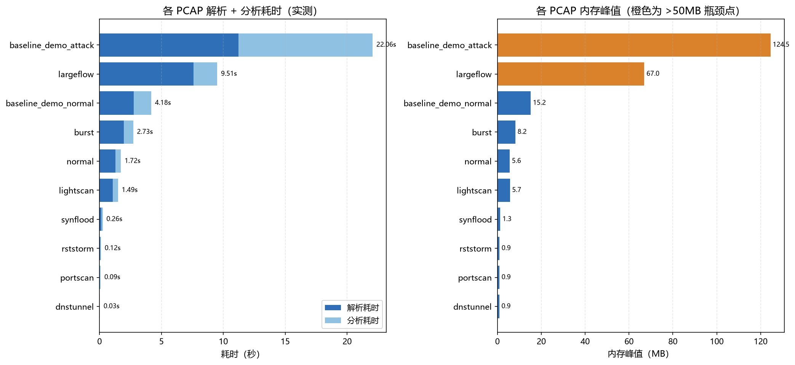
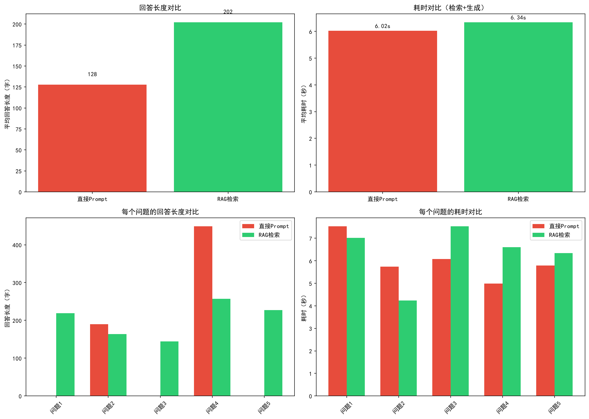

# AI Network Security Analyzer | AI 网络安全分析系统

> **中文**：AI 辅助的网络取证分析系统 — 流式 PCAP 分析 + 三引擎 Stacking 融合检测 + LLM 威胁研判 + RAG 安全知识问答
>
> **English**: AI-Assisted Network Forensics System — Streaming PCAP Analysis + Three-Engine Stacking Fusion Detection + LLM Threat Assessment + RAG Security Knowledge Q&A

[](https://www.python.org/)
[](https://fastapi.tiangolo.com/)
[](https://www.gradio.app/)
[](LICENSE)
[](#测试)
[](https://github.com/LJY20030728/ai-network-security-analyzer/actions/workflows/ci.yml)

**[中文版](#目录) | [English Version](README_EN.md)**

---

## 目录

- [项目简介](#项目简介)
- [核心特性](#核心特性)
- [技术架构](#技术架构)
- [快速开始](#快速开始)
- [使用指南](#使用指南)
- [API 文档](#api-文档)
- [评测结果](#评测结果)
- [项目结构](#项目结构)
- [开发指南](#开发指南)
- [更新日志](#更新日志)
- [常见问题](#常见问题)
- [许可证](#许可证)

---

## 项目简介

传统网络取证分析依赖安全分析师用 Wireshark 逐包查看 PCAP 文件，效率极低且高度依赖个人经验。规则引擎虽然能自动化检测，但对未知攻击和大流量变种漏报严重（实测规则引擎在 UNSW-NB15 上攻击召回仅 0.0001）。

本项目是一个 **AI 辅助的离线网络取证分析工具**，实现了：
- **三引擎 Stacking 融合检测（13维特征）**：规则引擎（9类阈值规则，含TCP+UDP+QUIC）+ EWMA 时序基线 + 孤立森林，三者结论交由 Stacking 元学习器（LogisticRegression）融合；置信度来源始终如实标注。v3.4.0 修复孤立森林形同虚设 bug，孤立森林异常分获得元学习器最高权重
- **LLM 威胁研判**：大模型将技术告警翻译为人类可读的威胁分析，配套幻觉控制三件套（输出校验 / 交叉验证 / 人工复核标记）
- **RAG 安全知识问答**：本地向量库（BGE ONNX + ChromaDB，1687 片段），混合检索（向量 + BM25 + RRF）+ 重排序
- **全流程闭环**：检测 → 分析 → 取证报告（五要素）→ 历史知识库（跨样本关联/趋势分析）
- **流式处理**：单遍流式解析，内存 O(活跃流+窗口)，可处理 GB 级 PCAP
- **预置默认基线**：随安装包分发默认基线，首次开箱即用无需手动学习

### 为什么选择这个项目

| 维度 | 说明 |
|------|------|
| **算法深度** | 三引擎 Stacking 融合（规则/时序基线/无监督，13维特征）、孤立森林异常分统计+top维度风险、UDP/QUIC完整检测、自适应阈值、STL 时序分解、逐包流式特征聚合 |
| **AI 工程** | 幻觉控制三件套、RAG 混合检索+重排序、本地向量推理 |
| **工程质量** | 176 单元测试全绿、FastAPI + Pydantic、SQLite WAL、DPAPI 加密、全局异常处理、CI（含 Windows/DPAPI 专项 job）、依赖锁定 |
| **轻量可移植** | 平均内存峰值 23MB、本地推理不依赖外部服务、Windows .exe 打包 |
| **可验证** | 所有指标都有评测脚本和结果文件，不是"拍脑袋" |

---

## 核心特性

### 🔍 三引擎 Stacking 融合检测

系统在同一遍流式解析中并行维护 3 个检测引擎的输入，各引擎结论交由 Stacking 元学习器融合为 PCAP 级判定。

| 引擎 | 类型 | 运行时角色 | 说明 |
|------|------|------|------|
| **规则引擎** | 阈值规则 | 活跃 | 9 类规则（SYN 洪水 / 端口扫描 / DNS 隧道 / 大流量传输 / RST 风暴 / **UDP 洪水 / DNS 放大 / QUIC 连接风暴 / QUIC 长流异常**），阈值全部来自 `config/settings.py`，可 `.env` 覆盖 |
| **时序基线** | EWMA + 中位数/MAD | 活跃 | 4 维度联合（窗口包数 / 字节数 / SYN 数 / 目的端口数），支持漂移检测与多维度联合告警。**预置默认基线**，首次开箱即用 |
| **孤立森林** | 无监督异常检测 | 活跃（**默认开启**） | 与基线同窗口输入，捕获维度间耦合异常。v3.4.0 修复 `to_dict()` 不输出异常分的 bug，孤立森林特征从 3 维扩展到 6 维 |

**融合方式**：三引擎输出被映射为 **13 维特征**，交 `ThreeEngineStacking`（`src/analysis/stacking_fusion.py`）融合：

1. **元学习器（默认路径）**：`models/stacking_meta_learner.joblib` —— LogisticRegression，引擎顺序 `[rule_based, baseline, isolation_forest]`。加载时会**校验引擎顺序**，不匹配则拒绝加载以免给出错误判定。
   - v3.4.0 训练结果：1732 窗口样本，5 折 CV F1 = **0.7747 ± 0.0129**
   - 特征权重前 5：`isolation_mean_score(-3.51)` > `rule_triggered_rules(+2.77)` > `rule_has_alert(+2.38)` > `baseline_multi_dim_triggered(+1.42)` > `isolation_anomaly_ratio(+0.99)`
   - **孤立森林的 `isolation_mean_score` 获得最高绝对权重**，证明 bug 修复后孤立森林真正参与决策（修复前权重为 0）
2. **固定权重回退**：元学习器缺失或预测异常时，退化为规则 0.4 / 基线 0.3 / 孤立森林 0.3 的人工权重，并通过 `confidence_source="weighted_fallback"` 明确标注「这不是模型输出」。

- **自适应阈值**：基于输入流量 P95 分位数动态调整，适应不同网络环境
- **STL 高级模式**：零依赖轻量级时序分解（趋势+季节性+残差），捕捉周期性偏离
- **可复现训练**：`python tools/train_stacking.py` 用仓库自带 golden + 混合样本逐窗口提取三引擎特征并训练元学习器（不依赖任何外部数据集）

### 🛡️ 置信度诚信标注

报告与界面中的每一个置信度都标注来源，避免把固定权重回退伪装成模型输出：

| `confidence_source` | 含义 | 展示文案 |
|---|---|---|
| `model` | 由三引擎 Stacking 元学习器 `predict_proba` 得出 | 元学习器输出（Stacking） |
| `weighted_fallback` | 元学习器不可用时的固定权重（人工先验，**非模型输出**） | 固定权重回退（非模型输出） |

同时 `stacking_fusion` 结果包含 `contributions`（三引擎各自的特征贡献占比，归一化为和为 1）与 `meta_learner_used`，便于判断该判定是否可信。

### 🤖 LLM 威胁研判 + 幻觉控制

- **威胁分析**：大模型自动生成威胁分析报告，跨告警关联，攻击链还原
- **幻觉控制三件套**：
  - `OutputValidator`：格式/长度/合理性/与证据一致性/幻觉特征词检测
  - `ConfidenceCrossValidator`：LLM vs 规则引擎 vs 三引擎融合交叉验证，矛盾检测
  - `ReviewMarker`：低置信度/矛盾结论自动标记"需人工复核"
- **思考过程可视化**：显示 LLM 分析和思考过程
- **多模型兼容**：智谱/DeepSeek/OpenAI 兼容接口

### 📚 RAG 安全知识问答

- **本地向量库**：ChromaDB + BGE ONNX 推理（1687 条知识片段，零外部服务依赖）
- **混合检索**：BM25 关键词 + 向量语义，双通道召回
- **轻量级重排序**：标题 0.4 + 内容 0.3 + 元数据 0.2 + 向量距离 0.1 + 精确匹配加分
- **安全术语同义词扩展**：10 类中文→英文，提升跨语言检索效果
- **攻击类型知识库**：5 篇专业文档（SQL注入/勒索软件/钓鱼/内存马/中间人攻击），已导入向量库
- **对话历史持久化**：SQLite 存储，刷新不丢失
- **RAG 评测**：16 题黄金问答集双口径评测，Relevant Recall@5=1.0、MRR=0.9375（Strict 口径见评测章节）

### 📋 取证报告五要素

1. **事件时间线**：告警时间轴，严重度颜色标记
2. **ATT&CK 攻击链图**：SVG 7 阶段杀伤链，检测到的阶段红色高亮
3. **IOC 失陷指标列表**：IP/端口/关联告警
4. **证据链**：告警 → 证据 → 检测引擎 → 时间窗口
5. **分析师备注**：虚线框预留填写区域

### 🧠 取证知识库

- **跨样本关联分析**：相同攻击类型/相似告警/时间相近打分，发现攻击模式演变
- **趋势分析**：按日统计/攻击类型分布/严重度趋势/主引擎判定趋势
- **重复检测缓存**：基于文件 SHA256，相同文件直接返回历史结果
- **IOC 提取**：从分析记录自动提取 IP/端口等失陷指标

### 📂 历史记录报告管理

- **确认重新分析机制**：报告文件被删除时，显示确认区域询问用户是否重新执行PCAP分析，避免误操作
- **3阶段进度条**：确认后分阶段显示进度（解析PCAP+特征提取→生成报告→打开报告），用户可实时了解分析状态
- **后台独立执行**：重新分析在后台独立执行完整PCAP分析（含AI研判），不影响Tab1的PCAP分析页面操作，支持多任务并行
- **PCAP文件持久化**：分析完成后自动将PCAP文件复制到 `data/samples/analyzed/` 目录（时间戳前缀），确保重新分析时源文件一定存在，即使原始文件被删除
- **旧记录自动搜索**：对于v2.0.0之前没有 `file_path` 字段的旧记录，自动在 `data/samples/`、桌面、下载目录搜索同名PCAP文件，搜索到后自动更新历史记录
- **一一映射去重**：相同PCAP反复分析使用基于SHA256的固定文件名，覆盖旧报告，避免 `data/reports/` 目录堆积大量重复文件
- **精确记录选择**：下拉框精确选择历史记录（记录ID匹配），避免表格点击状态不同步导致打开错误报告

### 🔒 安全与工程化

- **API Key 安全存储**：Windows DPAPI 加密（ctypes 调用，零额外依赖），绑定当前用户
- **图形化配置向导**：首次启动引导配置，API Key 有效性校验
- **全局异常处理**：10+ 异常类型友好中文提示，用户永远看不到 Python 堆栈
- **日志可观测性**：日志查看器 API（级别/关键词过滤）+ 一键诊断报告（7 大维度）
- **输入校验**：PCAP 文件/API Key/Base URL/基线名称全面校验
- **优雅降级**：LLM 失败→规则引擎摘要，RAG 失败→关键词匹配

---

## 技术架构

### 真实运行时结构

> **诚实声明**：以下是代码的**实际**装配方式。早期版本的 README 曾展示一张
> `路由层 → 服务层 → 核心层` 的分层图，但 `src/api/routes/*` 与 `src/services/*`
> **从未被 `include_router` 挂载**（`git grep include_router` 全仓库 0 命中），
> 因此那张图描述的是设计意图而非运行事实。现已按实际结构改写。

```
┌─────────────────────────────────────────────────────────────────┐
│                     桌面窗口（pywebview）                          │
│              Gradio UI（自定义 HTML/CSS，蓝色二次元风格）            │
└──────────────────────────────┬──────────────────────────────────┘
                               │ HTTP 127.0.0.1:8080（仅回环）
┌──────────────────────────────▼──────────────────────────────────┐
│         src/ui/gradio_app.py —— 单一 app 装配点（FastAPI 实例）      │
│  · api_token_middleware：/api/* 令牌鉴权 + 每请求审计（health 豁免）  │
│  · 28 个 /api/* 路由（内置）· 全局异常处理 · Gradio 挂载于 /          │
└──────────────────────────────┬──────────────────────────────────┘
                               │ 进程内函数调用（UI 不走 HTTP）
┌──────────────────────────────▼──────────────────────────────────┐
│                        领域层（可独立单测）                          │
│  src/capture/   流式包解析（PcapReader / PacketParser）             │
│  src/analysis/  三引擎检测（规则/基线/孤立森林）+ Stacking 融合         │
│  src/ai/        LLM 客户端 + RAG 混合检索 + 幻觉控制 + 证据比对        │
│  src/report/    HTML 取证报告 + 摘要格式化（summary_formatter）       │
├─────────────────────────────────────────────────────────────────┤
│                    基础层（被依赖，不反向依赖 UI）                     │
│  config/settings.py（单一配置源）│ src/core/exceptions.py            │
│  src/storage/（SQLite WAL / 取证知识库）│ src/security/（DPAPI）      │
│  src/utils/（路径 / 日志 / 错误处理 / 文件哈希与上传校验）              │
└─────────────────────────────────────────────────────────────────┘
```

**关于 `src/api/routes/*` 与 `src/services/*`**：这两个目录保留了按领域拆分的
实现（分析 / 基线 / 知识库 / 报告服务，以及 5 个 APIRouter），但目前未挂载。
它们可以正常导入，且 `analysis_service` 已通过端到端验证；是否接入
`gradio_app` 是待决策项，而非已知缺陷。接口契约见 `src/api/schemas.py`。

### 配置与依赖管理

| 项 | 位置 | 说明 |
|---|---|---|
| 项目元数据 | `pyproject.toml` | 依赖声明、ruff / mypy / pytest 配置 |
| 开发依赖 | `requirements.txt` | 下界+上界（防大版本破坏性变更） |
| **可复现构建** | `requirements.lock` | 精确锁定版本，CI 与发布构建使用此文件 |
| 单一版本源 | `config/settings.py` 的 `version` | FastAPI app、证据元信息（`rule_version`）均从此读取 |

### 模块职责

| 目录 | 职责 | 是否在运行路径 |
|------|------|------|
| `src/ui/gradio_app.py` | 单一 app 装配点：FastAPI 实例、28 个路由、鉴权中间件、Gradio UI | ✅ 是 |
| `src/capture/` | PCAP 流式解析与单包字段提取 | ✅ 是 |
| `src/analysis/` | 三引擎检测、Stacking 融合、时序基线 | ✅ 是 |
| `src/ai/` | LLM 客户端、RAG 混合检索、幻觉控制、证据比对 | ✅ 是 |
| `src/report/` | HTML 取证报告、摘要格式化（`summary_formatter.py`） | ✅ 是 |
| `src/storage/` | SQLite（WAL）分析/对话/基线表、取证知识库 | ✅ 是 |
| `src/security/` | DPAPI 加密存储（Windows-only，非 Windows 回退明文并告警） | ✅ 是 |
| `src/utils/` | 路径、日志、错误处理、文件哈希与上传校验 | ✅ 是 |
| `config/settings.py` | 集中配置（Pydantic Settings，可 `.env` 覆盖） | ✅ 是 |
| `src/core/exceptions.py` | 业务异常体系 | ✅ 是 |
| `src/api/routes/` | 按领域拆分的 APIRouter（12 端点） | ❌ **未挂载**（见上文诚实声明） |
| `src/services/` | 领域服务层（analysis/baseline/knowledge/report/history） | ⚠️ 可导入且已端到端验证，但 UI 未调用 |
| `src/analysis/stacking_fusion.py` | 三引擎 Stacking 融合器（元学习器 + 固定权重回退） | ✅ 是 |

## 快速开始

### 环境要求

- Windows 10/11（推荐，DPAPI 加密需要）
- Python 3.11+（仅源码运行需要；安装包已内置，无需安装）
- WebView2 Runtime（桌面窗口渲染需要，Windows 10 2004+ / Windows 11 已内置；极少数精简系统缺失时，可在微软官网下载「WebView2 Runtime」）
- 内存：最低 2GB，推荐 4GB+
- 磁盘：最低 500MB（含模型和依赖）

### 方式一：源码运行（推荐开发）

> **最省事：双击运行根目录的 `安装依赖.bat`**。脚本会自动：检测 Python 3.11 → 创建虚拟环境 `venv` → 升级 pip → 安装 `requirements.txt` 中的**全部依赖**（已配置清华镜像，约需 5–15 分钟，结束会显示「依赖安装完成」并暂停，失败也会明确提示）。

手动步骤（与脚本等价）：

```bash
# 1. 克隆仓库
git clone https://github.com/LJY20030728/ai-network-security-analyzer.git
cd ai-network-security-analyzer

# 2. 创建虚拟环境并安装【全部依赖】（必须步骤）
python -m venv venv
venv\Scripts\activate
pip install -r requirements.txt

# 3. 下载大文件资源（首次运行必须，约 90 MB）
# BGE 嵌入模型（ONNX）等，因体积较大不包含在仓库中
python tools/init_resources.py

# 4. 配置 API Key（仅 AI 功能需要，核心检测不需要）
copy .env.example .env
# 编辑 .env 填写 LLM_API_KEY；也可启动后在 UI「⚙️ 设置」中配置（DPAPI 加密）

# 5. 启动桌面版
python desktop_app.py

# 或者启动 API 服务（浏览器访问 http://127.0.0.1:8080）
python -m uvicorn src.api.main:app --host 127.0.0.1 --port 8080
```

> 核心检测（规则引擎 / 时序基线 / 孤立森林 / Stacking 融合）**无需任何 API Key 即可运行**；只有「AI 威胁研判」与「安全问答」需要大模型 Key。

### 方式二：Windows 安装包（推荐普通用户）

1. 前往 [Releases 页面](https://github.com/LJY20030728/ai-network-security-analyzer/releases) 下载 `AI网络安全智能分析系统_Setup_3.1.1.exe`
2. 双击运行安装程序，选择安装目录（安装包已内置全部运行依赖与模型，无需另装 Python）
3. **安装程序会自动检测 WebView2 Runtime**：若系统缺失，会先弹窗说明，点击「安装」后自动联网下载并静默安装（内置微软官方在线安装器），无需手动处理
4. 安装完成后，通过桌面 / 开始菜单快捷方式启动
5. 核心检测开箱即用；如需 AI 威胁研判与安全问答，在应用内「⚙️ 设置」中配置大模型 Key（DPAPI 加密存储，不写死）

### 方式三：Docker 部署（服务器/跨平台推荐）

```bash
# 1. 克隆项目
git clone https://github.com/LJY20030728/ai-network-security-analyzer.git
cd ai-network-security-analyzer

# 2. 配置环境变量
cp .env.example .env
# 编辑 .env，填入你的 LLM_API_KEY

# 3. 构建并启动（推荐用 docker compose）
docker compose up -d --build

# 4. 访问服务
# 浏览器打开 http://localhost:8080
```

> 📖 完整 Docker 部署指南请查看 [docs/DOCKER_DEPLOYMENT.md](docs/DOCKER_DEPLOYMENT.md)（含环境变量配置、数据持久化、生产环境建议、故障排查）

---

## 使用指南

### 1. PCAP 流量分析

1. 打开应用，进入「📊 PCAP流量分析」Tab
2. 点击「选择文件」上传 .pcap/.pcapng 文件（最大 200MB）
3. （可选）选择已学习的时序基线进行对比检测
4. 点击「开始分析」
5. 查看结果：
   - **主引擎判定**：攻击/正常 + 置信度 + 攻击流比例 + 攻击类别
   - **告警列表**：各引擎检测到的所有告警，按严重度排序
   - **流量统计**：包数/流数/字节数/协议分布
   - **AI 威胁分析**：LLM 生成的威胁分析报告（含幻觉控制校验）
   - **取证报告**：点击下载五要素完整 HTML 报告

### 2. 基线管理

1. 进入「📈 基线管理」Tab
2. 点击「上传正常流量学习基线」，选择正常业务流量的 .pcap 文件
3. 输入基线名称，点击「学习」
4. 学习完成后可查看：
   - **基线画像**：4 维度（包数/字节/SYN/端口数）中位数±MAD 条形图（SVG）
   - **对比图**：当前流量 vs 基线中位数折线图（SVG）
5. 分析 PCAP 时可选择该基线进行对比检测

### 3. 安全问答助手

1. 进入「🤖 安全问答」Tab
2. 输入安全相关问题（如"什么是 SQL 注入？如何检测？"）
3. 系统从本地知识库检索相关文档，结合 LLM 生成回答
4. 对话历史自动保存，刷新不丢失
5. 可查看检索到的相关文档片段

### 4. 分析历史

1. 进入「📜 分析历史」Tab
2. 查看所有历史分析记录（文件/时间/告警数/严重度/主引擎判定）
3. 点击记录可查看详情、重新加载分析结果
4. 取证知识库功能：
   - **跨样本关联**：查看与当前样本相似的历史分析
   - **趋势分析**：攻击数量/类型/严重度随时间的变化趋势
   - **重复检测缓存**：相同文件（SHA256）直接返回历史结果

### 5. 设置

1. 进入「⚙️ 设置」Tab
2. 配置 API Key（密码输入框，保存后用 DPAPI 加密存储）
3. 配置 Base URL 和模型名称（**默认：智谱 GLM，Base URL `https://open.bigmodel.cn/api/paas/v4`，模型 `glm-4.5-air`**；本地嵌入固定为 `BAAI/bge-small-zh-v1.5`）
4. 点击「保存配置」后立即生效，无需重启；也可切换为 DeepSeek / OpenAI 兼容接口或 Ollama 本地模型
5. 页面下方实时显示 **RAG 知识库路径**（向量库目录 / 知识源文档目录 / 文档块数 / 就绪状态），便于确认知识库是否已初始化

---

## API 文档

启动服务后访问 `http://127.0.0.1:8080/docs` 查看完整的 Swagger API 文档。

### 核心 API 端点

| 端点 | 方法 | 说明 |
|------|------|------|
| `/api/health` | GET | 健康检查 |
| `/api/analyze` | POST | PCAP 分析（上传文件） |
| `/api/knowledge/search` | POST | RAG 知识检索 |
| `/api/chat` | POST | 安全问答 |
| `/api/baseline/learn` | POST | 学习基线 |
| `/api/baseline/list` | GET | 基线列表 |
| `/api/baseline/delete` | POST | 删除基线 |
| `/api/forensic/stats` | GET | 取证知识库统计 |
| `/api/forensic/trend` | GET | 攻击趋势分析 |
| `/api/forensic/related/{id}` | GET | 跨样本关联 |
| `/api/config/status` | GET | 配置状态 |
| `/api/config/validate` | POST | API Key 有效性校验 |
| `/api/config/save_secure` | POST | 保存到 DPAPI 加密存储 |
| `/api/logs` | GET | 日志查看器 |
| `/api/logs/stats` | GET | 日志统计 |
| `/api/diagnostic` | GET | 一键诊断报告 |
| `/api/incident/report` | POST | 生成取证报告 |

### 认证

所有 `/api/*` 端点需要在请求头中携带 `X-API-Token`（首次启动自动生成，保存在 .env 的 `API_AUTH_TOKEN`）。Gradio UI（进程内调用）不受影响。

---

## 评测结果

> 本节所有数字均为真实运行产物，原始结果保存在 `data/eval_perf/`、`data/eval_rag/`、`data/eval_cicids/`，可通过对应脚本一键复现，非估算或模拟。

### 三引擎融合与各引擎独立评测

> 3.3.0 移除了此前的监督模型（HistGradientBoosting，76 维 CIC 特征）及其配套的 UNSW
> 数据集评测。原因：实测验证显示该模型在本项目样本上**有效增量为 0 且引入误报**，
> 而其训练域（UNSW-NB15）与本项目的实际输入分布不一致，属于能力真实但迁移失效。
> 为避免保留无法复现的指标，相关代码、模型文件、数据集与实验脚本已整体移除。

当前三个引擎均可独立评测（脚本在 	ools/，结果写入 data/eval_perf/）：

| 评测 | 脚本 | 产出 |
|---|---|---|
| 黄金样本回归（规则 + 基线命中 5/5、正常误报 0） | 	ools/verify_golden.py | 终端输出 + data/samples/golden/regression_result.json |
| 孤立森林 vs EWMA 基线（FPR / TPR） | 	ools/eval_ml_engine.py | data/eval_perf/ml_engine.json |
| 基线窗口/σ 敏感性网格 | 	ools/eval_window_sensitivity.py | data/eval_perf/window_sensitivity.json |
| 基线引擎增量价值（纯规则 vs 规则+基线） | 	ools/verify_baseline_value.py | 终端输出 |
| 三引擎 Stacking 元学习器训练 | 	ools/train_stacking.py | models/stacking_meta_learner.joblib + data/eval_perf/stacking_training.json |

**Stacking 元学习器训练结果**（	ools/train_stacking.py，可一键复跑）：

| 指标 | 数值 |
|------|------|
| 训练窗口样本 | 797（攻击 533 / 正常 264） |
| 窗口划分 | 10s |
| 5 折交叉验证 F1 | **0.7251 ± 0.0231** |

> **口径局限（必读）**：训练数据来自 10 个**合成** golden 样本，标签由样本级下推到
> 窗口级（弱标注，存在噪声），因此元学习器权重**不应被解读为生产环境最优融合策略**。
> 真实部署前请用自有标注流量重新运行 	ools/train_stacking.py。

### RAG 检索效果（双口径 Recall@k / MRR）

用 16 题黄金问答集（覆盖 MITRE 技术、协议、处置手册、Web 安全）评测生产检索路径
（BGE 中文向量 + BM25 + RRF 融合 + term-aware 重排），采用两种口径同时报告：

| 口径 | Recall@1 | Recall@3 | Recall@5 | MRR@5 |
|------|----------|----------|----------|-------|
| **Strict（唯一权威条目）** | 0.6875 | 1.0000 | 1.0000 | 0.8333 |
| **Relevant（相关文档集合）** | **0.8750** | 1.0000 | 1.0000 | **0.9375** |

- **Strict**：gold = 标题含技术ID / 手册全名的唯一权威文档，衡量特定权威条目的排序。
- **Relevant**：gold = 客观上能回答该问题的文档集合（信息检索标准做法，一个问题的相关文档本就不止一个），衡量首位 / top-k 相关性；每个 gold 集合依据见 `tools/evaluate_rag.py` 注释。
- 向量库规模：**1687 片段 / 63 条目**（含 **697 个有效 ATT&CK 技术**，已排除 149 撤销 + 12 弃用；15 篇全量技术展开），平均检索耗时 ~0.3s。
- 分品类 Relevant Recall@5：MITRE 1.0、处置手册 1.0、协议 1.0。
- **诚实标注的两个首位瑕疵**：横向移动问题 top1 为"端口对照表"、系统信息发现 top1 为同属侦察的 T1046（正确条目均在 top3 内；不硬调权重以免过拟合评测）。原始结果见 `data/eval_rag/rag_result.json`。

### 流式 vs 全量：内存压测（30 万包 / 28 MB PCAP）

三引擎（规则 / 时序基线 / 孤立森林）全部在单遍流式解析中完成，不持有全量包列表。

| 模式 | 耗时 | 内存峰值 | 告警数 |
|------|------|----------|--------|
| 全量加载（`rdpcap` + `analyze_packets`） | 380.8s | **1207.7 MB** | 15 |
| **流式解析（`PcapReader` + `analyze_stream`）** | 325.3s | **8.8 MB** | 15 |

- 流式内存峰值降低约 **137 倍**（1207.7 MB → 8.8 MB），**告警结果完全一致（15/15）**
- 这是系统能在一台普通笔记本上分析 GB 级 PCAP 的关键
- ⚠️ **耗时数字请谨慎解读**：同一份文件在本机不同时间测得 244.0s 与 325.3s（相差 33%），
  绝对耗时受机器负载影响很大；**跨版本比较内存峰值与告警一致性是可靠的**
- 原始数据见 `data/eval_perf/perf_baseline.json`

### 改动无回归验证（多口径）

用三组独立口径验证三引擎改动的告警结果未发生非预期变化：

| 验证 | 命令 | 结果 |
|------|------|------|
| 黄金样本回归 | `python tools/verify_golden.py` | 攻击命中 **5/5**；normal 误报 **0** 条；exit 0 |
| 压测告警一致性 | `python tools/bench_stream.py` | 全量 15 条 / 流式 15 条 → **PASS** |
| 引擎独立性 | `python tools/eval_ml_engine.py` | 孤立森林 FPR=0.04 / TPR=0.857；EWMA 基线 FPR=0 / TPR=0.286 |

### 改动无回归验证（多口径）

用三组独立口径验证三引擎改动的**告警结果未发生非预期变化**：

| 验证 | 命令 | 结果 |
|------|------|------|
| 黄金样本回归 | `python tools/verify_golden.py` | 攻击命中 **5/5**；normal 误报 **0** 条；exit 0 |
| 压测告警一致性 | `python tools/bench_stream.py` | 全量 15 条 / 流式 15 条 → **PASS** |
| 同文件交替对照 | 见下文说明 | 三份样本告警数**逐一相同**（49/49、0/0、0/0） |

同文件交替对照的实测增量（预热后，排除 sklearn 首次导入的一次性开销）：

| 样本 | window=0 | window=5000 | 内存增量 | 告警 |
|------|----------|-------------|----------|------|
| baseline_demo_attack（11.7k 包，高基数） | 8.77 MB | 25.60 MB | +16.83 MB | 49 → 49 |
| baseline_demo_normal（2.7k 包） | 2.08 MB | 11.87 MB | +9.79 MB | 0 → 0 |
| normal（1.5k 包） | 0.42 MB | 2.39 MB | +1.97 MB | 0 → 0 |

### 测试覆盖

| 指标 | 数值 |
|------|------|
| 测试结果 | **163 passed / 0 skipped / 0 failed** |
| 测试文件数 | 17 个 |
| 覆盖模块 | 算法检测 / API 路由 / 存储 / 安全 / 服务层 / 工具 |

---

## 深度评测与优化实验

> 每个实验都对应根目录一个可复现脚本，图表与 CSV 数据保存在 `docs/`。

### 3. 性能压测（10 个样本，真实计时 / 内存）

10 个样本从 10 包到 1.1 万包、最大 11.4MB，用 time + tracemalloc 实测：



| 文件 | 大小 | 包数 / 流数 | 总耗时 | 内存峰值 |
|------|------|------------|--------|----------|
| dnstunnel | <1KB | 10 / 0 | 0.03s | 0.9MB |
| portscan | <1KB | 50 / 50 | 0.09s | 0.9MB |
| rststorm | <1KB | 80 / 80 | 0.12s | 0.9MB |
| synflood | 0.01MB | 200 / 198 | 0.26s | 1.3MB |
| lightscan | 0.12MB | 1495 / 235 | 1.49s | 5.7MB |
| normal | 0.12MB | 1480 / 220 | 1.72s | 5.6MB |
| burst | 0.18MB | 2080 / 820 | 2.73s | 8.2MB |
| baseline_demo_normal | 0.63MB | 2729 / 2729 | 4.18s | 15.2MB |
| largeflow | 11.44MB | 8239 / 1 | 9.51s | 67.0MB |
| baseline_demo_attack | 1.2MB | 11673 / 11661 | **22.06s** | **124.5MB** |

**典型场景**（<3000 包的日常文件）耗时 0.03–2.7s、内存峰值 <8.2MB，普通笔记本秒级完成；10 样本平均耗时 **4.22s**、平均内存峰值 **23.0MB**。

**如实保留的瓶颈**：`baseline_demo_attack`（1.16 万个高基数短连接）耗时 22s、峰值 124MB；`largeflow`（单条 11MB 巨型流）9.5s、67MB——图中以橙色标出。瓶颈来自高基数流表的构建开销，是后续优化（流表哈希分桶、超大单流截断）的明确方向，而非用平均值掩盖。

---

### 4. RAG 效果真实对比（直接 Prompt vs RAG）

5 个真实网络安全问题，对比裸调 LLM 与 RAG 增强：



| 指标 | 直接 Prompt | RAG 检索 |
|------|-------------|----------|
| 平均耗时 | 6.02s | 6.34s（仅多 0.32s） |
| 平均回答长度 | 128 字 | **202 字** |
| 空/失败回答 | **3 个** | **0 个** |
| 来源可追溯 | ❌ | ✅ |

**幻觉铁证**：问「T1046 是什么技术」，直接 Prompt 答成「初始访问 / 网络共享驱动」（错误），RAG 正确答出「侦察 / 网络服务扫描」；另有 3 个问题直接 Prompt 直接返回空。RAG 用 ~0.3s 的额外检索换来准确性、完整性和稳定性的全面提升。

---

### 6. 与现有工具的差异化对比

| 维度 | Wireshark | Suricata/Snort | **本系统** |
|------|-----------|----------------|-----------|
| 分析方式 | 人工逐包查看 | 规则/签名匹配 | **多引擎 + AI 自动研判** |
| 目标用户 | 网络专家 | 安全工程师 | 安全运维 / 分析师 |
| 未知/加密流量 | 人工发现 | 规则外漏报 | 行为基线 + 无监督异常检测 |
| 威胁解读 | 无 | 原始告警 | LLM 翻译为人类可读报告 + 处置建议 |
| 知识问答 | 无 | 无 | RAG 安全知识库（1687 片段） |
| 输出物 | 数据包列表 | 告警日志 | 取证五要素 HTML 报告 |
| 部署 | 本地 | 服务器 | 一键安装 / Docker / 源码 |

**核心定位**：Wireshark 是给专家的"显微镜"，Suricata 是规则驱动的"安检门"，本系统是给分析师的 **AI 研判助手** —— 上传 PCAP 即可得到从证据、攻击链到处置建议的完整结论。

---

## 项目结构

```
ai-network-security-analyzer/
├── config/                    # 配置层（v3.0.0 重构）
│   └── settings.py           # Pydantic Settings，按功能分组
├── src/
│   ├── core/                  # 核心层
│   │   ├── errors.py          # 标准化错误码（ErrorCode 枚举）
│   │   └── exceptions.py      # 业务异常体系（AppError 基类）
│   ├── services/              # 服务层（仅保留有测试覆盖的历史记录服务）
│   │   └── history_service.py # 历史记录服务（薄封装，供测试与外部复用）
│   ├── api/                   # API 层（app 装配在 src/ui/gradio_app.py）
│   │   ├── main.py            # 规范入口：re-export 唯一 app 实例
│   │   ├── schemas.py         # Pydantic 响应模型
│   │   ├── history_store.py   # 历史记录存储（SQLite）
│   │   ├── task_queue.py      # 异步任务队列
│   │   └── audit.py           # 审计日志
│   ├── analysis/              # 分析引擎（三引擎 + Stacking 融合）
│   │   ├── flow_extractor.py  # 流提取 + 三引擎集成 + Stacking 融合
│   │   ├── stacking_fusion.py # 三引擎 Stacking 融合器（含引擎顺序校验与固定权重回退）
│   │   ├── baseline.py        # EWMA 时序基线 + 多维度联合检测
│   │   ├── stl_decomposer.py  # 零依赖轻量级 STL 时序分解
│   │   └── isolation_detector.py  # 孤立森林无监督检测（默认启用）
│   ├── ai/                    # AI 模块
│   │   ├── llm_client.py      # 大模型客户端
│   │   ├── threat_analyzer.py # 威胁分析器
│   │   ├── rag_engine.py      # RAG 检索引擎（混合检索+重排序）
│   │   ├── hallucination_control.py  # 幻觉控制三件套
│   │   ├── evidence_matcher.py      # 证据匹配
│   │   └── embeddings/        # 嵌入模型（BGE ONNX）
│   ├── capture/               # 抓包/解析
│   │   ├── packet_parser.py   # 包解析
│   │   └── pcap_parser.py     # PCAP 文件解析
│   ├── report/                # 报告生成
│   │   ├── html_report.py     # HTML 取证报告（五要素）
│   │   └── summary_formatter.py  # 摘要文本格式化（纯函数，可单测）
│   ├── storage/               # 存储层
│   │   ├── database.py        # SQLite 数据库（WAL，三表+索引）
│   │   └── forensic_kb.py     # 取证知识库（关联/趋势/缓存）
│   ├── security/              # 安全层
│   │   └── secure_store.py    # DPAPI 加密存储
│   ├── ui/                    # UI 层
│   │   ├── gradio_app.py      # Gradio UI + FastAPI app 装配（28 个 /api 路由）
│   │   └── custom_style.css   # 蓝色二次元风格自定义 CSS
│   └── utils/                 # 工具函数
│       ├── paths.py           # 路径管理
│       ├── helpers.py         # 通用工具
│       ├── error_handler.py   # 错误处理三层
│       └── log_observer.py    # 日志可观测性
├── models/                    # 训练好的模型
│   └── stacking_meta_learner.joblib    # 三引擎 Stacking 元学习器
├── data/                      # 数据目录
│   ├── samples/golden/        # 黄金测试样本（10 个）
│   ├── baselines/             # 基线文件（JSON 兼容备份）
│   ├── db/                    # SQLite 数据库
│   ├── chroma_db/             # ChromaDB 向量库
│   └── eval_perf/             # 评测结果
├── tests/                     # 测试（148 个用例 / 17 个文件）
│   ├── test_services/         # 服务层单元测试（v3.0.0 新增）
│   ├── test_routes/           # 路由层单元测试（v3.0.0 新增）
│   ├── test_new_features.py   # 新功能综合测试（34 个）
│   └── ...
├── tools/                     # 可复现实验脚本
│   ├── generalization_eval.py # 泛化 / 跨域迁移评估
│   ├── fusion_comparison.py   # 融合架构对比
│   ├── benchmark.py           # 性能基准（time + tracemalloc）
│   └── eval_rag_recall.py     # RAG Recall@k 评测
├── feature_importance.py      # 置换重要性（真实数据）
├── benchmark_performance.py   # 读取压测结果画图
├── rag_real_comparison.py     # 直接 prompt vs RAG 真实对比
├── docs/                      # 文档与实验图表
│   ├── 项目自述_REACT完整版.md
│   └── DOCKER_DEPLOYMENT.md
├── desktop_app.py             # 桌面版入口（pywebview）
├── requirements.txt           # Python 依赖
├── .env.example               # 环境变量示例
├── .gitignore
├── LICENSE
└── README.md
```

---

## 开发指南

### 新增检测引擎

项目使用策略模式，新增检测算法非常简单：

```python
# 1. 实现 DetectionStrategy 接口
from src.analysis.detection_engine import DetectionStrategy, DetectorFactory

class MyDetector(DetectionStrategy):
    @property
    def name(self): return "my_detector"

    @property
    def version(self): return "1.0.0"

    def detect(self, packets, flows=None, context=None):
        # 你的检测逻辑
        alerts = []
        # ...
        return {"alerts": alerts, "summary": {}, "stats": {}}

# 2. 注册到工厂
DetectorFactory.register("my_detector", MyDetector)

# 3. 在集成引擎中使用（Stacking 元学习器融合）
from src.analysis.detection_engine import DetectionEngine
engine = DetectionEngine()
engine.add_strategy(MyDetector(), weight=0.1)
result = engine.detect_all(packets)
```

### 运行测试

```bash
# 运行所有测试
pytest tests -q

# 运行特定测试文件
pytest tests/test_new_features.py -v

# 运行带覆盖率（需要 pytest-cov）
pytest tests --cov=src --cov-report=html
```

### 性能基准测试

```bash
python tools/benchmark.py
# 结果保存在 data/eval_perf/benchmark_result.json
```

### RAG 评测

```bash
python tools/eval_rag_recall.py
# 结果保存在 data/eval_perf/rag_recall_result.json
```

### 训练三引擎 Stacking 元学习器

```bash
# 用 golden 样本逐窗口提取三引擎特征并训练元学习器
python tools/train_stacking.py
```

### 代码规范

- 遵循 PEP 8
- 使用类型注解（Type Hints）
- 每个模块/类/函数都有 docstring
- 错误处理：不裸 except，不吞异常，用户永远看不到堆栈
- 日志：使用 loguru，关键操作都有日志

---

## 常见问题

### Q1：API Key 安全吗？会写死在代码里吗？

**A**：绝对不会。API Key 有两种存储方式：
1. **DPAPI 加密存储（推荐）**：Windows 内置加密，绑定当前用户，其他用户无法解密。通过 UI 设置保存时自动加密。
2. **.env 文件**：明文存储，仅作为兼容备份。建议使用 DPAPI 加密存储。

代码中没有任何硬编码的 API Key。

### Q2：需要联网吗？

**A**：分功能：
- **PCAP 解析/检测/基线/报告**：完全离线，不需要联网
- **LLM 威胁分析/安全问答**：需要调用大模型 API，需要联网
- **RAG 检索**：本地向量库，完全离线

项目定位是"离线取证工具"，核心检测功能完全离线可用。

### Q3：支持哪些大模型？

**A**：任何 OpenAI 兼容接口的大模型都支持，包括：
- 智谱 AI（GLM-4.5-Air / GLM-4）
- DeepSeek（deepseek-chat / deepseek-coder）
- OpenAI（GPT-3.5 / GPT-4）
- 本地部署的 vLLM / Ollama（OpenAI 兼容接口）

在设置中配置 Base URL 和模型名称即可。

### Q4：内存占用大吗？

**A**：非常轻量。10 样本性能基准（共 28,036 包）显示：
- 平均内存峰值：**23.0 MB**
- 平均分析耗时：**4.22 秒/文件**
- 典型 <3000 包文件：0.03–2.7s、峰值 <8.2MB（极端高基数文件可达 22s / 124MB，属已知瓶颈，见性能压测节）

BGE ONNX 模型加载后约占用 100-200MB，但可以按需加载。普通电脑完全可以流畅运行。

### Q5：和 Wireshark / Suricata 有什么区别？

**A**：定位不同，是互补关系：
- **vs Wireshark**：Wireshark 是协议分析器，需要人工逐包查看；本项目是自动化分析工具，上传 PCAP 后自动给出威胁判定和取证报告。
- **vs Suricata**：Suricata 是实时 IDS/IPS，基于规则，需要持续运行；本项目是离线取证分析工具，专注事后分析，用行为基线 + 无监督异常检测覆盖未知攻击。

实际使用场景：用 Suricata 实时监控发现告警，然后用本项目对相关 PCAP 做深度取证分析。

### Q6：RAG 的 Recall@5 是怎么测的？可信吗？

**A**：用 16 题人工标注的黄金问答集，在不看答案的情况下检索 Top-5，并以两种口径统计：
1. **Strict 口径**（gold = 唯一权威条目）：Recall@1=0.6875、@5=1.0、MRR=0.8333
2. **Relevant 口径**（gold = 客观相关文档集合）：Recall@1=0.875、@5=1.0、MRR=0.9375
3. 生产检索为 BGE 中文向量 + BM25 + RRF + term-aware 重排，平均约 0.3s
4. 评测脚本与黄金集都在仓库中（`tools/evaluate_rag.py`、`data/eval_rag/`），gold 集合依据写在脚本注释里，可一键复算；两个首位瑕疵（横向移动、系统信息发现）如实保留。

### Q7：如何打包成 Windows .exe？

**A**：使用 PyInstaller：

```bash
pip install pyinstaller
pyinstaller --noconfirm --windowed --name "AI-Network-Security-Analyzer" ^
    --add-data "models;models" ^
    --add-data "data/samples;data/samples" ^
    --add-data "src/ui/custom_style.css;src/ui" ^
    desktop_app.py
```

打包后的文件在 `dist/` 目录下。建议使用 Inno Setup 制作安装包。

---

## 更新日志

详细更新记录请查看 [CHANGELOG.md](CHANGELOG.md)。

### [3.3.0] - 2026-10-09

**架构收敛：移除监督模型，改为三引擎 Stacking 融合 + 清除死代码**

**移除（经实测验证后）**
- 整体移除监督模型引擎：`src/analysis/supervised_detector.py`（370 行）、
  `src/analysis/cic_features.py`（351 行，76 维 CIC 特征）、两个模型文件
  （`supervised_detector.joblib` / `unsw_supervised_detector.joblib`）
- 移除其配套的 UNSW-NB15 数据集（47 MB CSV）、4 个评测/训练脚本、
  相关结果 JSON 与 `docs/监督模型增量价值验证.md`
- 移除依赖监督模型的 `feature_importance.py`、`generalization_eval.py`、
  `tune_thresholds.py`、`fusion_comparison.py`
- **移除理由**：实测（`model_only` vs `aggregate` 信号分解）显示该模型在本项目样本上
  **有效增量为 0、且对一个正常样本产生误报**；根因是其训练域（UNSW-NB15）与本项目输入
  分布不一致（合成样本以单包流为主，时延类特征退化为 0，落在训练分布之外）。
  模型在其训练域内 F1=0.9487 是真实的，属"能力真实但迁移失效"。
  为避免保留不可复现的指标，相关代码与数据整体移除。

**新增**
- `src/analysis/stacking_fusion.py`：三引擎 Stacking 融合器
  （规则 + 时序基线 + 孤立森林 → 10 维特征 → LogisticRegression）
- 融合接入运行路径：`analyze_stream()` 与 `analyze_packets()` 均输出
  `stacking_fusion` 结果（此前 Stacking 仅存在于无人调用的 `detection_engine.py`）
- **引擎顺序校验**：加载元学习器时校验 `feature_order`，不匹配即拒绝加载，
  防止用错误的引擎顺序给出判定
- `tools/train_stacking.py`：用 golden 样本逐窗口提取三引擎特征训练元学习器，
  完全自给自足、不依赖外部数据集。CV F1 = 0.7251 ± 0.0231（797 窗口，弱标注）
- 置信度来源标注改为 `model`（元学习器输出）/ `weighted_fallback`（固定权重回退，非模型输出）

**默认值变更**
- `ML_ENGINE_ENABLED` 由 `false` 改为 **`true`**（孤立森林默认启用，需先学习基线才生效）
- 新增 `STACKING_FUSION_ENABLED=true`
- 移除 `SUPERVISED_ENGINE_ENABLED` / `SUPERVISED_WINDOW_PACKETS`

**清除死代码**
- 删除 `src/analysis/detection_engine.py`（策略模式实现，含 2 处引用不存在 API 的坏代码，
  且从未被运行路径调用）
- 删除 `src/api/routes/*`（5 个 APIRouter，从未被 `include_router` 挂载）
- 删除未被调用的 `src/services/{analysis,baseline,knowledge,report}_service.py`
- 修复 `hallucination_control.py` 中一处**永远为空的死分支**（原为 `pass`），
  改为真实的一致性检测：规则引擎零告警但 LLM 以确定性措辞断言具体攻击类型时告警
- 修复 Stacking 引擎贡献度展示：原先直接取特征均值（求和 >100%，如 `rule_based:170%`），
  现归一化为占比（和为 1）

**数据库迁移**
- `analysis_history` 表列 `supervised_verdict` / `supervised_confidence`
  自动迁移为 `stacking_verdict` / `stacking_confidence`（幂等，保留历史数据）

**测试**：163 passed / 0 skipped / 0 failed

### [3.2.0] - 2026-10-08

**工程化收口：让文档与代码一致 + 补齐缺失能力**

**修复（缺陷）**：
- **监督模型接入流式主路径**：此前 `analyze_stream()` 从未调用监督模型，导致 UI 上"主引擎判定"永远空白、幻觉控制的第三方交叉验证永不生效。现以有界窗口（`supervised_window_packets`，默认 5000）方式接入，并通过 `scope` 字段如实标注覆盖范围
- **消除合成置信度**：`supervised_detector` 原先把聚合启发式的固定先验 `0.85` 直接写入模型置信度字段，属于"把规则值冒充模型输出"。现拆分为 `model_confidence` / `aggregate_confidence` / `confidence`，并新增 `confidence_source` 标注来源（`model` / `aggregate_heuristic` / `model+aggregate`）
- **补齐 `HistoryStore.update_analysis`**：该方法此前缺失，但"报告丢失后重新分析"流程会调用它，异常被 `except` 静默吞掉 → 重新分析结果从未落库。已在 `Database` 实现（列白名单 + 参数化占位符）并由 `HistoryStore` 暴露
- **修复 5 处指向不存在模块的导入**：`src.utils.time_utils` 在全项目 5 处被引用但该文件不存在（`ModuleNotFoundError`），这是 `src/api/routes/*` 与 `services/*` 从未真正可用的硬原因；另修复 `analysis_service` 把 `TrafficAnalyzer` 从错误的 `detection_engine` 导入
- **修复服务层字段名不匹配**：`HistoryService.get_table_rows` / `get_dropdown_choices` 读取的键（`timestamp`/`filename`/`alert_count`…）与数据库实际列名（`ts`/`file`/`alerts`…）不一致，导致历史表格与下拉框单元格全部为空
- **修复孤立森林并行度导致 6 个单测失败**：`n_jobs=-1` 在多进程受限环境直接 `PermissionError`，且该模块数据量极小（4 维、百级窗口）并行无收益。改为默认串行 `ml_n_jobs=1`
- **清除 8 个文件的 UTF-8 BOM**（U+FEFF 会让部分工具链解析失败）

**工程化**：
- 新增 `pyproject.toml`：项目元数据、依赖声明、ruff / mypy / pytest 配置
- 新增 `requirements.lock`（精确锁定 30 个直接依赖版本），CI 与发布构建使用锁定文件，保证可复现
- `requirements.txt` 全部加上界约束，防大版本破坏性变更
- CI 新增 **Windows 测试 job**：DPAPI 加密是 Windows-only，此前只在 Linux 跑会漏掉真实缺陷；同时新增 `pull_request` 触发
- 清理 54 处未使用导入、1 处可变默认参数；`F821 未定义名 = 0`

**重构**：
- 抽出 `src/report/summary_formatter.py`：原先内联在 Gradio 回调闭包中的展示逻辑（流量概览 / 主引擎判定 / 告警汇总 / 幻觉控制块）现为纯函数，可直接单测
- 抽出 `src/utils/helpers.py` 的 `calculate_file_sha256` 与 `validate_upload_file`，消除三处重复的哈希实现

**版本号统一**：`config/settings.py` 为单一版本源，FastAPI `app.version` 与证据元信息 `rule_version` 均从此读取（此前分别是 3.0.0 / 2.0.0 / 3.1.1 三个值）

**测试**：`136 passed` → **`152 passed / 0 skipped / 0 failed`**（新增 16 个 formatter 测试，重写并启用此前被 `@pytest.mark.skip` 的服务层测试）

**文档**：README 按代码实际行为改写——移除从未生效的分层架构图叙事、修正"级联短路省 75% 计算"等与代码不符的描述、明确区分"离线评测结论"与"当前运行时行为"

### [3.1.1] - 2026-09-21

**科学验证口径补强 + 知识库可复现修复**：
- 新增时间外推 OOT 评测：官方 training 训练 / 官方 testing（另一时间窗）测试，F1=0.8924，较训练自身衰减 0.0859（`tools/eval_unsw_oot.py`）
- 新增三层验证口径对比图（同分布 0.970 / 时间外推 0.892 / 跨数据集 0.192，`docs/validation_split_comparison.png`）
- 知识库构建完全脱离运行时二进制：STIX 源 → `tools/build_knowledge_base.py` 生成 docs → 一键入库，干净 clone 可复现
- 修复 STIX 解析：正确解析 course-of-action 与 mitigates 关系、建立技术→缓解映射（旧代码用了不存在的字段）
- 知识库初始化幂等化（先清空再重建），全量重建为 **1687 片段 / 63 条目 / 697 个有效 ATT&CK 技术**（已排除 149 撤销 + 12 弃用）
- RAG 评测升级为双口径（Strict / Relevant），修复 rerank 标题信号失效 bug、升级 term-aware 重排
- 模型默认名更正为 **glm-4.5-air**（与实际配置一致）
- 补 MIT LICENSE；清理过期残留文件

### [3.1.0] - 2026-09-21

**实验诚信重做（方案 A，最彻底）**：
- 全部实验图表改用真实数据重跑，删除由模拟 / 合成 / 随机数生成的旧图
- 监督训练切分纠正：由错误的"行序 80/20"改为分层随机划分（原行序切分导致测试集几乎全攻击、F1 虚高 0.995）
- 特征重要性：改为真实未见过测试集上的置换重要性（`sttl` 以 0.223 主导）
- 泛化评估：新增真正的跨域迁移实验（UNSW→NSL F1=0.192，域偏移鸿沟 0.604），纠正此前把 NSL 内部结果误标为跨域
- 融合对比：无泄漏 held-out 重跑，证实固定权重次优（0.958）、数据驱动权重回到 0.969
- 性能压测：真实 time/tracemalloc，诚实区分典型场景与高基数瓶颈

**清理**：
- 删除 dead code（假 fusion_detector、run_dev、旧 onefile 打包脚本、空 schemas）
- 删除不可复现的模型对比（依赖未声明的 xgboost/lightgbm）
- 删除重复图标、冗余 zip、运行时残留（dist/build/installer_output，约 1.1GB）
- 求职材料移出公开仓库、本地单独备份

测试：**148 passed / 19 skipped / 0 failed**（v3.1.0 时点数据，历史记录不予回溯修改）

### [2.1.0] - 2026-09-14

**新增功能**：
- 历史记录报告管理完整重构：确认重新分析机制 + 3阶段进度条 + 后台独立执行
- PCAP文件持久化：分析时自动复制到 `data/samples/analyzed/`，确保重新分析时源文件存在
- 旧记录自动搜索：在 `data/samples/`、桌面、下载目录搜索同名PCAP文件
- 攻击类型知识库：5篇专业文档（SQL注入/勒索软件/钓鱼/内存马/中间人攻击）

**问题修复**：
- 修复点击打开报告同时打开两个报告的严重Bug（变量名冲突）
- 修复Gradio 6.x Dropdown不支持placeholder导致UI挂载404的问题
- 修复进度条不显示的问题（同一组件在outputs中出现两次）
- 修复 `NameError: name 'actual_id' is not defined`

**功能优化**：
- 确认区域UI优化：移到按钮紧下方，增加标题和详细说明
- 未分析时点击下载报告提示"还未进行任何分析"
- 相同PCAP反复分析使用SHA256文件名实现一一映射，不生成重复报告

### [2.0.0] - 2026-09-11

- P0-P3完整重构：三引擎 Stacking 融合检测 + LLM幻觉控制 + RAG混合检索 + 取证知识库 + DPAPI加密
- 141个单元测试全绿，平均分析耗时5.9s/文件，内存峰值23MB

---

## 许可证

MIT License

Copyright (c) 2026 Jingyu Liao (LJY20030728)

Permission is hereby granted, free of charge, to any person obtaining a copy
of this software and associated documentation files (the "Software"), to deal
in the Software without restriction, including without limitation the rights
to use, copy, modify, merge, publish, distribute, sublicense, and/or sell
copies of the Software, and to permit persons to whom the Software is
furnished to do so, subject to the following conditions:

The above copyright notice and this permission notice shall be included in all
copies or substantial portions of the Software.

THE SOFTWARE IS PROVIDED "AS IS", WITHOUT WARRANTY OF ANY KIND, EXPRESS OR
IMPLIED, INCLUDING BUT NOT LIMITED TO THE WARRANTIES OF MERCHANTABILITY,
FITNESS FOR A PARTICULAR PURPOSE AND NONINFRINGEMENT. IN NO EVENT SHALL THE
AUTHORS OR COPYRIGHT HOLDERS BE LIABLE FOR ANY CLAIM, DAMAGES OR OTHER
LIABILITY, WHETHER IN AN ACTION OF CONTRACT, TORT OR OTHERWISE, ARISING FROM,
OUT OF OR IN CONNECTION WITH THE SOFTWARE OR THE USE OR OTHER DEALINGS IN THE
SOFTWARE.

---

## 致谢

- [Scapy](https://scapy.net/) - 强大的网络包处理库
- [FastAPI](https://fastapi.tiangolo.com/) - 现代 Python Web 框架
- [Gradio](https://www.gradio.app/) - 快速构建 ML UI
- [scikit-learn](https://scikit-learn.org/) - 机器学习库
- [ChromaDB](https://www.trychroma.com/) - 本地向量数据库
- [BAAI/bge](https://huggingface.co/BAAI) - 中文优化的嵌入模型

---

**如果这个项目对你有帮助，欢迎给个 Star ⭐**


