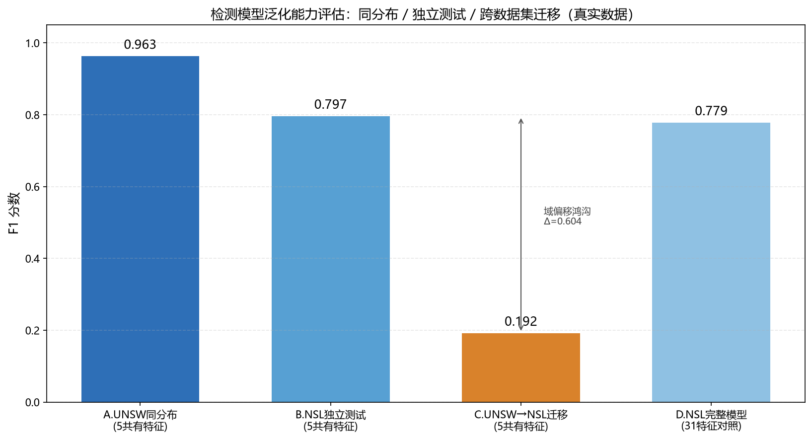
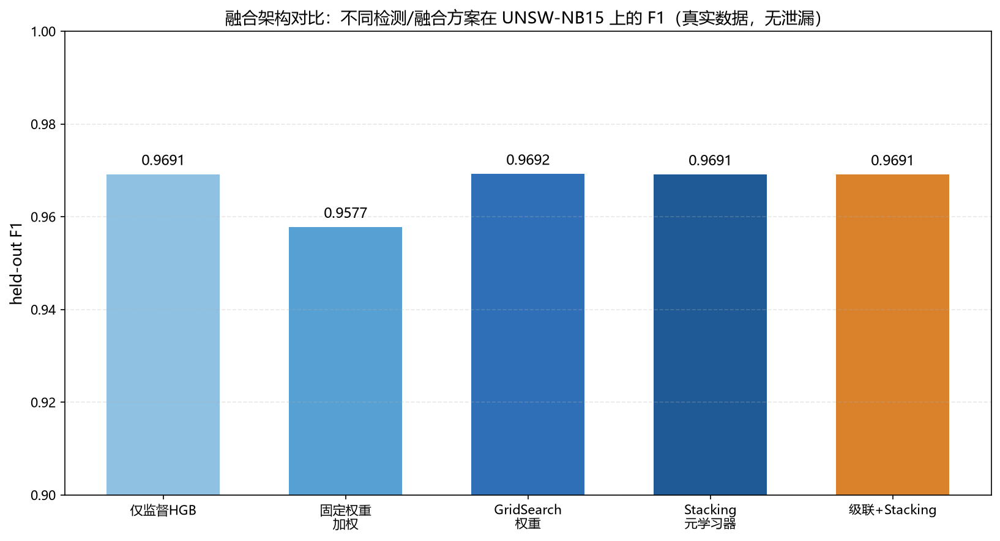

# AI Network Security Analyzer

> AI-Assisted Network Forensics System — PCAP Offline Analysis + Four-Engine Integrated Detection + LLM Threat Assessment + RAG Security Knowledge Q&A

[](https://www.python.org/)
[](https://fastapi.tiangolo.com/)
[](https://www.gradio.app/)
[](LICENSE)
[](#testing)

**[中文版 README](README.md) | English Version**

---

## Table of Contents

- [Project Overview](#project-overview)
- [Core Features](#core-features)
- [Technical Architecture](#technical-architecture)
- [Quick Start](#quick-start)
- [Usage Guide](#usage-guide)
- [API Documentation](#api-documentation)
- [Evaluation Results](#evaluation-results)
- [Project Structure](#project-structure)
- [Development Guide](#development-guide)
- [FAQ](#faq)
- [License](#license)

---

## Project Overview

Traditional network forensics relies on security analysts manually inspecting PCAP files packet-by-packet with Wireshark — extremely inefficient and highly dependent on individual experience. While rule engines automate detection, they suffer from severe false negatives for unknown attacks (rule-engine attack recall on UNSW-NB15 is only 0.0001).

This project is an **AI-assisted offline network forensics analysis tool** that implements:
- **Four-Engine Integrated Detection**: Supervised model (HistGradientBoosting) as primary engine + Rule engine + EWMA time-series baseline + Isolation Forest, with weighted voting to reduce false positives/negatives
- **LLM Threat Assessment**: Large language model translates technical alerts into human-readable threat analysis, with hallucination control trilogy
- **RAG Security Knowledge Q&A**: Local vector store (BGE ONNX + ChromaDB), hybrid retrieval + reranking
- **Full-Process Closed Loop**: Detection → Analysis → Forensic Report (five elements) → Historical Knowledge Base (cross-sample correlation / trend analysis)

### Why This Project?

| Dimension | Description |
|-----------|-------------|
| **Algorithm Depth** | 76-dim CICFlowMeter feature extraction, four-engine ensemble voting, adaptive threshold, STL time-series decomposition |
| **AI Engineering** | Hallucination control trilogy, RAG hybrid retrieval + reranking, local vector inference |
| **Engineering Quality** | 148 unit tests, FastAPI + Pydantic, SQLite WAL, DPAPI encryption, global exception handling |
| **Lightweight & Portable** | Average memory peak 23MB, local inference no external service dependency, Windows .exe packaging |
| **Verifiable** | All metrics have evaluation scripts and result files — no "guesstimates" |

---

## Core Features

### 🔍 Four-Engine Integrated Detection

| Engine | Type | Weight | Description |
|--------|------|--------|-------------|
| **Supervised Model** | HistGradientBoosting | 0.5 | 76-dim CICFlowMeter features, flow-level prediction + PCAP-level aggregation, F1=0.9487 |
| **Rule Engine** | Threshold rules | 0.2 | 10+ configurable rules (SYN flood / port scan / DNS tunnel / RST storm, etc.) |
| **Time-Series Baseline** | EWMA + Median/MAD | 0.15 | 4-dimension joint detection, multi-dimension simultaneous deviation triggers CRITICAL |
| **Isolation Forest** | Unsupervised anomaly | 0.15 | Suitable for low-dimensional tabular data, detects unknown anomalies |

- **Adaptive Threshold**: Dynamically adjusted based on input traffic P95 percentile, adapts to different network environments
- **STL Advanced Mode**: Zero-dependency lightweight time-series decomposition (trend + seasonality + residual), captures periodic deviations
- **Strategy Pattern Architecture**: Extensible — new detection algorithms only need to implement the interface and register

### 🤖 LLM Threat Assessment + Hallucination Control

- **Threat Analysis**: LLM automatically generates threat analysis reports, cross-alert correlation, attack chain reconstruction
- **Hallucination Control Trilogy**:
  - `OutputValidator`: Format / length / reasonableness / evidence consistency / hallucination keyword detection
  - `ConfidenceCrossValidator`: LLM vs Rules vs Supervised Model cross-validation, contradiction detection
  - `ReviewMarker`: Low-confidence / contradictory conclusions automatically marked "needs human review"
- **Thinking Process Visualization**: Displays LLM analysis and thinking process
- **Multi-Model Compatibility**: Zhipu / DeepSeek / OpenAI compatible interfaces

### 📚 RAG Security Knowledge Q&A

- **Local Vector Store**: ChromaDB + BGE ONNX inference (933 knowledge chunks, zero external service dependency)
- **Hybrid Retrieval**: BM25 keyword + vector semantic, dual-channel recall
- **Lightweight Reranking**: Title 0.4 + Content 0.3 + Metadata 0.2 + Vector Distance 0.1 + Exact Match bonus
- **Security Terminology Synonym Expansion**: 10 categories Chinese→English, improves cross-language retrieval
- **Conversation History Persistence**: SQLite storage, no loss on refresh

### 📋 Forensic Report Five Elements

1. **Event Timeline**: Alert timeline with severity color coding
2. **ATT&CK Attack Chain Diagram**: SVG 7-stage kill chain, detected stages highlighted in red
3. **IOC (Indicators of Compromise) List**: IP / Port / associated alerts
4. **Evidence Chain**: Alert → Evidence → Detection Engine → Time Window
5. **Analyst Notes**: Dashed box reserved for filling

### 🧠 Forensic Knowledge Base

- **Cross-Sample Correlation Analysis**: Same attack type / similar alerts / time proximity scoring, discovers attack pattern evolution
- **Trend Analysis**: Daily statistics / attack type distribution / severity trend / primary engine verdict trend
- **Duplicate Detection Cache**: Based on file SHA256, same file directly returns historical results
- **IOC Extraction**: Automatically extracts IP / Port and other indicators from analysis records

### 🔒 Security & Engineering

- **API Key Secure Storage**: Windows DPAPI encryption (ctypes call, zero extra dependency), bound to current user
- **Graphical Configuration Wizard**: First-launch guided configuration, API key validity check
- **Global Exception Handling**: 10+ exception types friendly Chinese prompts, users never see Python stack traces
- **Log Observability**: Log viewer API (level / keyword filtering) + one-click diagnostic report (7 dimensions)
- **Input Validation**: PCAP file / API Key / Base URL / baseline name comprehensive validation
- **Graceful Degradation**: LLM failure → rule engine summary, RAG failure → keyword matching

---

## Technical Architecture

```
┌─────────────────────────────────────────────────────────────────┐
│                     Desktop Window (pywebview)                    │
│           Gradio UI + Custom HTML/CSS (Blue Anime Style)         │
└──────────────────────────────┬──────────────────────────────────┘
                               │ HTTP (localhost:8080)
┌──────────────────────────────▼──────────────────────────────────┐
│                     FastAPI Backend Service                       │
│        Pydantic 20+ models │ Global Exception Handling │ Logs    │
└──────┬──────────┬──────────┬──────────┬──────────┬─────────────┘
       │          │          │          │          │
┌──────▼───┐ ┌───▼────┐ ┌──▼─────┐ ┌─▼──────┐ ┌▼────────────┐
│ Parsing  │ │Detection│ │  AI    │ │Storage │ │  Security    │
│ Scapy    │ │ 4-Eng  │ │ LLM+RAG│ │ SQLite │ │  DPAPI       │
│ Stream   │ │Ensemble│ │         │ │ WAL    │ │  Encrypted   │
└──────────┘ └────────┘ └────────┘ └────────┘ └─────────────┘
```

### Tech Stack

| Layer | Technology | Version | Description |
|-------|-----------|---------|-------------|
| **Language** | Python | 3.11 | - |
| **Backend** | FastAPI | 0.110+ | Async API, Pydantic validation |
| **Frontend** | Gradio | 6.x | Rapid UI, custom CSS |
| **Desktop** | pywebview | 5.x | Native window, system WebView |
| **Parsing** | Scapy | 2.5+ | PCAP stream parsing |
| **Algorithm** | scikit-learn | 1.3+ | HistGradientBoosting / IsolationForest |
| **AI** | Zhipu GLM LLM | glm-4-flash | Default LLM; also supports DeepSeek / OpenAI / Ollama |
| **Vector** | ChromaDB | 0.5+ | Local vector database |
| **Embedding** | BGE ONNX | bge-small-zh-v1.5 | Chinese-optimized, local inference, no API needed |
| **Storage** | SQLite | 3.x | WAL mode, three tables + indexes |
| **Security** | DPAPI (ctypes) | - | Windows built-in encryption |
| **Logging** | loguru | 0.7+ | Structured logging |
| **Testing** | pytest | 8.x+ | 148 passed / 19 skipped |

---

## Quick Start

### Requirements

- Windows 10/11 (recommended, DPAPI encryption requires)
- Python 3.11+ (only for running from source; the installer bundles it)
- WebView2 Runtime (needed to render the desktop window; preinstalled on Windows 10 2004+ / Windows 11; if missing on a stripped-down system, download 'WebView2 Runtime' from Microsoft)
- Memory: Minimum 2GB, recommended 4GB+
- Disk: Minimum 500MB (including models and dependencies)

### Method 1: Source Code Run (Recommended for Development)

> **Easiest: double-click `安装依赖.bat`** in the project root. It automatically: checks for Python 3.11 -> creates the `venv` -> upgrades pip -> installs **ALL dependencies** from `requirements.txt` (a Tsinghua mirror is preconfigured; takes ~5-15 min; it shows a completion message and pauses, and reports clearly on failure).

Manual steps (equivalent to the script):

```bash
# 1. Clone the repository
git clone https://github.com/LJY20030728/ai-network-security-analyzer.git
cd ai-network-security-analyzer

# 2. Create a virtual environment and install [ALL dependencies] (required)
python -m venv venv
venv\Scripts\activate
pip install -r requirements.txt

# 3. Download large file resources (required for first run, ~90 MB)
# BGE embedding model (ONNX), not included in the repo due to size
python tools/init_resources.py

# 4. Configure API Key (only needed for AI features, not for core detection)
copy .env.example .env
# Edit .env and fill in LLM_API_KEY; you can also do it later in UI Settings (DPAPI encrypted)

# 5. Start the desktop version
python desktop_app.py

# Or start the API service (browser access http://127.0.0.1:8080)
python -m uvicorn src.api.main:app --host 127.0.0.1 --port 8080
```

> Core detection (rule engine / supervised model / time-series baseline / isolation forest) runs **without any API Key**; only AI threat triage and security Q&A need an LLM key.

### Method 2: Windows Installer (Recommended for Users)

1. Go to the [Releases page](https://github.com/LJY20030728/ai-network-security-analyzer/releases) and download `AI网络安全智能分析系统_Setup_3.0.1.exe`
2. Double-click the installer and choose a directory (it bundles all runtime dependencies and models; no Python needed)
3. **The installer auto-detects WebView2 Runtime**: if missing, it notifies you up front and, after you click Install, automatically downloads and silently installs it (a signed Microsoft online installer is bundled)
4. After installation, launch from the desktop / Start Menu shortcut
5. Core detection works out of the box; for AI threat triage & Q&A, configure an LLM key in the in-app **Settings** (DPAPI encrypted, not hardcoded)

---

## Usage Guide

### 1. PCAP Traffic Analysis

1. Open the app, go to "📊 PCAP Traffic Analysis" tab
2. Click "Select File" to upload .pcap/.pcapng file (max 200MB)
3. (Optional) Select a learned time-series baseline for comparison detection
4. Click "Start Analysis"
5. View results:
   - **Primary Engine Verdict**: Attack / Normal + Confidence + Attack flow ratio + Attack category
   - **Alert List**: All alerts detected by four engines, sorted by severity
   - **Traffic Statistics**: Packet count / Flow count / Byte count / Protocol distribution
   - **AI Threat Analysis**: LLM-generated threat analysis report (with hallucination control validation)
   - **Forensic Report**: Click to download five-element complete HTML report

### 2. Baseline Management

1. Go to "📈 Baseline Management" tab
2. Click "Upload Normal Traffic to Learn Baseline", select normal business traffic .pcap file
3. Enter baseline name, click "Learn"
4. After learning, you can view:
   - **Baseline Profile**: 4-dimension (packets/bytes/SYN/ports) median±MAD bar chart (SVG)
   - **Comparison Chart**: Current traffic vs baseline median line chart (SVG)
5. When analyzing PCAP, you can select this baseline for comparison detection

### 3. Security Q&A Assistant

1. Go to "🤖 Security Q&A" tab
2. Enter security-related questions (e.g., "What is SQL injection? How to detect?")
3. System retrieves relevant documents from local knowledge base, combines with LLM to generate answers
4. Conversation history automatically saved, no loss on refresh
5. Can view retrieved relevant document fragments

### 4. Analysis History

1. Go to "📜 Analysis History" tab
2. View all historical analysis records (file / time / alert count / severity / primary engine verdict)
3. Click records to view details, reload analysis results
4. Forensic knowledge base features:
   - **Cross-Sample Correlation**: View historical analyses similar to current sample
   - **Trend Analysis**: Attack count / type / severity changes over time
   - **Duplicate Detection Cache**: Same file (SHA256) directly returns historical results

### 5. Settings

1. Go to "⚙️ Settings" tab
2. Configure API Key (password input field, saved with DPAPI encrypted storage)
3. Configure Base URL and model name
4. Click "Test Connection" to verify API Key validity
5. Saved and effective immediately, no restart required

---

## API Documentation

After starting the service, visit `http://127.0.0.1:8080/docs` for complete Swagger API documentation.

### Core API Endpoints

| Endpoint | Method | Description |
|----------|--------|-------------|
| `/api/health` | GET | Health check |
| `/api/analyze` | POST | PCAP analysis (upload file) |
| `/api/knowledge/search` | POST | RAG knowledge retrieval |
| `/api/chat` | POST | Security Q&A |
| `/api/baseline/learn` | POST | Learn baseline |
| `/api/baseline/list` | GET | Baseline list |
| `/api/baseline/delete` | POST | Delete baseline |
| `/api/forensic/stats` | GET | Forensic knowledge base statistics |
| `/api/forensic/trend` | GET | Attack trend analysis |
| `/api/forensic/related/{id}` | GET | Cross-sample correlation |
| `/api/config/status` | GET | Configuration status |
| `/api/config/validate` | POST | API Key validity check |
| `/api/config/save_secure` | POST | Save to DPAPI encrypted storage |
| `/api/logs` | GET | Log viewer |
| `/api/logs/stats` | GET | Log statistics |
| `/api/diagnostic` | GET | One-click diagnostic report |
| `/api/incident/report` | POST | Generate forensic report |

### Authentication

All `/api/*` endpoints require `X-API-Token` in request headers (auto-generated on first launch, stored in .env as `API_AUTH_TOKEN`). Gradio UI (in-process calls) is not affected.

---

## Evaluation Results

> Every number below comes from a real run artifact stored under `data/eval_perf/`, `data/eval_rag/`, and `data/eval_cicids/`, and can be reproduced with the matching script. Nothing is estimated or mocked.

### Supervised Model Detection Performance

A supervised model (HistGradientBoosting) acts as the **primary detector**, validated on two datasets:

| Dataset | Flows | Precision | Recall | F1 | Accuracy |
|---------|-------|-----------|--------|-----|----------|
| **UNSW-NB15** (in-distribution split) | 175,341 | 0.9637 | **0.9772** | **0.9704** | 0.9594 |
| **CIC-IDS** (CIC 76 features, in-distribution stratified) | 447,915 | 0.9351 | 0.9628 | **0.9487** | 0.9792 |

**vs unsupervised/rule engines** (same UNSW-NB15 test set):

| Detector | Attack Recall |
|----------|---------------|
| Rule engine (large-flow class) | 0.0001 |
| Isolation Forest | 0.2107 |
| Time-series baseline (best σ=2) | 0.5045 |
| **Supervised model** | **0.9772** |

The supervised model lifts attack recall from 0.0001 (rule engine) to 0.9772 — which is why it is the primary detector.

### Overfitting Check & Model Stability

| Metric | Value | Note |
|--------|-------|------|
| Train F1 | 0.9791 | — |
| Test F1 | 0.9704 | — |
| **F1 gap** | **0.0088** | ✅ Low overfitting risk (< 0.03) |
| **5-fold CV F1** | **0.9394 ± 0.0429** | Overall stable |
| L2 / early stopping | l2=1.0 / enabled | Double safeguard |

The train/test F1 gap is only 0.0088, so in-distribution overfitting risk is low. Note, however, that genuine cross-dataset transfer degrades sharply when feature systems do not align (see Generalization below; UNSW→NSL is only 0.192) — a new environment therefore needs baseline learning / local retraining rather than reusing a model as-is.

### UNSW-NB15 Per-Class Recall

| Attack | Recall | | Attack | Recall |
|--------|--------|-|--------|--------|
| Backdoor | 1.0000 | | Exploits | 0.9953 |
| Worms | 1.0000 | | DoS | 0.9988 |
| Generic | 1.0000 | | Shellcode | 0.9911 |
| Reconnaissance | 0.9991 | | Analysis | 0.9171 |
| Normal | 0.9215 | | Fuzzers | 0.8715 |

### RAG Retrieval (Recall@k / MRR)

A 16-question golden set (MITRE techniques, routing/transport protocols, incident handbooks, web security) evaluates BGE Chinese embeddings + BM25 hybrid retrieval:

| Metric | Value |
|--------|-------|
| Golden Q&A set | 16 questions |
| **Recall@1** | **0.9375** |
| Recall@3 | 0.9375 |
| **Recall@5** | **1.0000** |
| **MRR@5** | **0.9500** |
| Vector chunks / source docs | 933 / 20 |
| Average retrieval time | ~0.3s |

Per-category Recall@5: MITRE 1.0, handbooks 1.0, protocols 1.0. Raw output: `data/eval_rag/rag_result.json`.

### Streaming vs Full-Load Memory Test (300k packets / 28 MB PCAP)

| Mode | Time | Memory Peak | Alerts |
|------|------|-------------|--------|
| Full load | 246.7s | **1112.3 MB** | 15 |
| Streaming | 244.0s | **6.8 MB** | 15 |

Streaming cuts memory peak by **162.8x** with identical alerts (`data/eval_perf/perf_baseline.json`) — the key to analyzing GB-scale PCAPs on an ordinary laptop.

### Testing Coverage

| Metric | Value |
|--------|-------|
| Result | **148 passed / 19 skipped / 0 failed** |
| Test files | 19 |
| Covered modules | Detection algorithms / API routes / Storage / Security / Services / Utils |

---

## Deep Evaluation & Optimization Experiments

> Each experiment maps to a reproducible script in the root; charts and CSVs live in `docs/`.

### 1. Feature Importance (Permutation Importance)

Features are not guessed — permutation importance is measured on a genuinely unseen test set (a stratified, representative 4,000-flow subset; `n_repeats=3`, scored by F1):


| Rank | Feature | Importance | Meaning |
|------|---------|------------|---------|
| 1 | `sttl` | **0.2229** | Source-to-destination TTL (attack TTL distribution is highly anomalous; the decisive feature, far ahead of all others) |
| 2 | `ct_state_ttl` | 0.0089 | Flow-state TTL correlation count |
| 3 | `sbytes` | 0.0072 | Source-to-destination byte count |
| 4 | `ct_srv_src` | 0.0061 | Same-service connection count from source |
| 5 | `ct_srv_dst` | 0.0057 | Same-service connection count to destination |

A category-aggregated view is available at `docs/feature_category_importance.png`.

---

### 2. Generalization & Cross-Domain Transfer (including an honest "failure")

We do not hide the model's weakness. We select five semantically corresponding features shared by UNSW and NSL-KDD (duration / source bytes / destination bytes / connection count / same-service count) and test four settings:



| Setting | F1 | Note |
|---------|-----|------|
| A. UNSW same distribution | 0.9635 | Performance upper bound |
| B. NSL independent test set | 0.7967 | Drops after switching datasets |
| C. UNSW → NSL cross-domain transfer | **0.1924** | Applying the UNSW model to NSL nearly fails |
| D. NSL full 31 features | 0.7785 | Trained on NSL's own features (control) |

**Domain-shift gap Δ = 0.604.** This "ugly" result is the core justification for the design: **one model cannot be used directly across network environments** — protocol mix, service distribution and traffic baselines differ greatly. Instead of betting on one universal model, the product offers Baseline Management (learning each environment's own normal profile) and local retraining, while AI (RAG + LLM) handles cross-environment triage and explanation.

> Supervised-model choice: HistGradientBoosting vs XGBoost/LightGBM differs by < 0.01 in F1, but it is native sklearn with zero extra dependencies and the most stable under PyInstaller — the engineering-optimal choice, avoiding two heavy dependencies.

---

### 3. Performance Stress Test (10 samples, real timing / memory)

10 samples, from 10 packets to 11k packets, up to 11.4MB, measured with time + tracemalloc:


| File | Size | Packets / Flows | Time | Memory |
|------|------|-----------------|------|--------|
| dnstunnel | <1KB | 10 / 0 | 0.03s | 0.9MB |
| portscan | <1KB | 50 / 50 | 0.09s | 0.9MB |
| rststorm | <1KB | 80 / 80 | 0.12s | 0.9MB |
| synflood | 0.01MB | 200 / 198 | 0.26s | 1.3MB |
| lightscan | 0.12MB | 1495 / 235 | 1.49s | 5.7MB |
| normal | 0.12MB | 1480 / 220 | 1.72s | 5.6MB |
| burst | 0.18MB | 2080 / 820 | 2.73s | 8.2MB |
| baseline_demo_normal | 0.63MB | 2729 / 2729 | 4.18s | 15.2MB |
| largeflow | 11.44MB | 8239 / 1 | 9.51s | 67.0MB |
| baseline_demo_attack | 1.2MB | 11673 / 11661 | **22.06s** | **124.5MB** |

**Typical cases** (everyday files <3,000 packets): 0.03–2.7s, memory peak <8.2MB — second-level on an ordinary laptop; across the 10 samples average time is **4.22s**, average memory peak **23.0MB**.

**Bottlenecks kept honestly**: `baseline_demo_attack` (11.6k high-cardinality short connections) takes 22s / 124MB; `largeflow` (a single 11MB giant flow) 9.5s / 67MB — marked in orange on the chart. The bottleneck is high-cardinality flow-table construction, a clear target for later optimization (hashing/bucketing, giant-flow truncation) rather than being hidden by averages.

---

### 4. RAG Real Comparison (Direct Prompt vs RAG)

Five real security questions, comparing a bare LLM with RAG:


| Metric | Direct Prompt | RAG |
|--------|---------------|-----|
| Average time | 6.02s | 6.34s (+0.32s) |
| Average answer length | 128 chars | **202 chars** |
| Empty/failed answers | **3** | **0** |
| Traceable sources | ❌ | ✅ |

**Hard evidence of hallucination**: asked "What is T1046?", the direct prompt answered "Initial Access / Network Shared Drive" (wrong), while RAG correctly answered "Reconnaissance / Network Service Scanning"; the direct prompt also returned empty on 3 other questions. RAG trades ~0.3s of retrieval for accuracy, completeness, and reliability.

---

### 5. Fusion Architecture (Fixed Weights vs Data-Driven Weights)

Addressing "are the fusion weights guessed?", five schemes were tested on a leakage-free held-out set (base-engine predictions generated via 5-fold OOF on the dev set, the combiner trained, then evaluated on an independent 20%):



| Scheme | held-out F1 | Weight Source |
|--------|-------------|---------------|
| Supervised only | 0.9691 | — |
| Fixed-weight sum (0.5/0.2/0.15/0.15) | **0.9577** | ❌ Manual; weak engines dilute the strong supervisor |
| Grid-search weights | 0.9692 | ✅ Auto-finds supervised 0.9 / baseline 0.1 |
| Stacking (LogisticRegression) | 0.9691 | ✅ Learned (supervised coefficient 9.37, others ≈0) |
| Cascade + Stacking | 0.9691 | ✅ Rules decide first, rest goes to the meta-learner |

**Honest conclusion**: when the supervised model is already strong (UNSW), guessed fixed weights also mix in noise from weak engines (rule/isolation) and lower F1 (0.958 < 0.969); GridSearch/Stacking both concentrate weight on the supervisor (~0.9) and return to the optimum — proving **fusion weights must be data-driven**.

To be fair, fixed weights are not worthless: in a real-PCAP unknown-attack / unlabeled cold start, the supervised model may fail on out-of-distribution attacks, while the baseline and isolation forest provide signals the supervisor cannot; fixed weights are a conservative engineering trade-off for robustness. The engine injects a trained meta-learner via `set_meta_learner()` and falls back to weighted fusion when absent, so it works out of the box.

---

### 6. Differentiation from Existing Tools

| Dimension | Wireshark | Suricata/Snort | **This System** |
|-----------|-----------|----------------|-----------------|
| Method | Manual per-packet | Rules/signatures | **Multi-engine + AI assessment** |
| Target user | Network expert | Security engineer | Security ops / analyst |
| Unknown/encrypted | Manual discovery | Missed outside rules | Behavioral baseline + unsupervised + supervised fallback |
| Threat interpretation | None | Raw alerts | LLM human-readable report + remediation |
| Knowledge Q&A | None | None | RAG knowledge base (933 chunks) |
| Output | Packet list | Alert log | Forensic five-element HTML report |
| Deployment | Local | Server | Installer / Docker / source |

**Positioning**: Wireshark is an expert's "microscope", Suricata is a rule-driven "gate"; this system is an analyst's **AI assessment assistant** — upload a PCAP and get a complete conclusion from evidence and attack chain to remediation.

---

## Project Structure

```
ai-network-security-analyzer/
├── src/
│   ├── analysis/              # Analysis engine
│   │   ├── cic_features.py    # 76-dim CICFlowMeter feature extraction
│   │   ├── supervised_detector.py  # Supervised detector (HistGradientBoosting)
│   │   ├── flow_extractor.py  # Flow extraction + four-engine ensemble
│   │   ├── baseline.py        # EWMA time-series baseline + STL advanced detection
│   │   ├── stl_decomposer.py # Zero-dependency lightweight STL decomposition
│   │   ├── isolation_detector.py  # Isolation Forest unsupervised detection
│   │   └── detection_engine.py    # Strategy pattern + Factory pattern detection engine
│   ├── ai/                    # AI module
│   │   ├── llm_client.py      # LLM client
│   │   ├── threat_analyzer.py # Threat analyzer
│   │   ├── rag_engine.py      # RAG retrieval engine (hybrid + reranking)
│   │   ├── hallucination_control.py  # Hallucination control trilogy
│   │   ├── evidence_matcher.py      # Evidence matcher
│   │   └── embeddings/        # Embedding model (BGE ONNX)
│   ├── api/                   # API layer
│   │   ├── main.py            # FastAPI main app + Gradio UI
│   │   ├── schemas.py         # Pydantic models (20+)
│   │   ├── history_store.py   # History storage (SQLite)
│   │   ├── task_queue.py      # Task queue
│   │   └── audit.py           # Audit log
│   ├── capture/               # Capture / parsing
│   │   ├── packet_parser.py   # Packet parser
│   │   └── pcap_parser.py     # PCAP file parser
│   ├── report/                # Report generation
│   │   └── html_report.py     # HTML forensic report (five elements)
│   ├── storage/               # Storage layer
│   │   ├── database.py        # SQLite database (WAL, three tables + indexes)
│   │   └── forensic_kb.py     # Forensic knowledge base (correlation / trend / cache)
│   ├── security/              # Security layer
│   │   └── secure_store.py    # DPAPI encrypted storage
│   ├── ui/                    # UI resources
│   │   └── custom_style.css   # Blue anime style custom CSS
│   └── utils/                 # Utility functions
│       ├── paths.py           # Path management
│       ├── helpers.py         # Common utilities
│       ├── error_handler.py   # Three-layer error handling
│       └── log_observer.py    # Log observability
├── models/                    # Trained models
│   ├── supervised_detector.joblib      # CIC supervised model (F1=0.9487)
│   └── unsw_supervised_detector.joblib # UNSW dedicated model (Recall=0.9772)
├── data/                      # Data directory
│   ├── samples/golden/        # Golden test samples (10)
│   ├── baselines/             # Baseline files (JSON compatible backup)
│   ├── eval_perf/             # Evaluation results
│   └── ...                    # (db/history/chroma_db generated at runtime)
├── tests/                     # Tests (148)
├── tools/                     # Reproducible experiment scripts
│   ├── init_resources.py      # Resource initialization (download BGE + MITRE)
│   ├── train_unsw_supervised.py  # UNSW model training (stratified random)
│   ├── eval_supervised_baseline.py  # CIC supervised baseline
│   ├── generalization_eval.py # Generalization / cross-domain transfer
│   ├── fusion_comparison.py   # Fusion architecture comparison
│   ├── benchmark.py           # Performance benchmark (time + tracemalloc)
│   └── eval_rag_recall.py     # RAG Recall@k evaluation
├── feature_importance.py      # Permutation importance (real data)
├── benchmark_performance.py   # Reads benchmark results and plots
├── rag_real_comparison.py     # Direct prompt vs RAG real comparison
├── docs/                      # Documentation and charts
│   ├── 项目自述_REACT完整版.md (Project narrative, REACT)
│   └── DOCKER_DEPLOYMENT.md
├── config/                    # Configuration
│   └── settings.py            # Global config (pydantic-settings)
├── desktop_app.py             # Desktop entry (pywebview)
├── requirements.txt           # Python dependencies
├── .env.example               # Environment variable example
├── .gitignore
├── LICENSE
├── README.md                  # Chinese README
└── README_EN.md               # English README (this file)
```

---

## Development Guide

### Adding a New Detection Engine

The project uses the Strategy pattern — adding a new detection algorithm is simple:

```python
# 1. Implement DetectionStrategy interface
from src.analysis.detection_engine import DetectionStrategy, DetectorFactory

class MyDetector(DetectionStrategy):
    @property
    def name(self): return "my_detector"

    @property
    def version(self): return "1.0.0"

    def detect(self, packets, flows=None, context=None):
        # Your detection logic
        alerts = []
        # ...
        return {"alerts": alerts, "summary": {}, "stats": {}}

# 2. Register with factory
DetectorFactory.register("my_detector", MyDetector)

# 3. Use in ensemble engine (automatic weighted voting)
from src.analysis.detection_engine import DetectionEngine
engine = DetectionEngine()
engine.add_strategy(MyDetector(), weight=0.1)
result = engine.detect_all(packets)
```

### Running Tests

```bash
# Run all tests
pytest tests -q

# Run specific test file
pytest tests/test_new_features.py -v

# Run with coverage (requires pytest-cov)
pytest tests --cov=src --cov-report=html
```

### Performance Benchmark

```bash
python tools/benchmark.py
# Results saved in data/eval_perf/benchmark_result.json
```

### RAG Evaluation

```bash
python tools/eval_rag_recall.py
# Results saved in data/eval_perf/rag_recall_result.json
```

### Training Supervised Models

```bash
# CIC model
python tools/eval_supervised_baseline.py

# UNSW dedicated model
python tools/train_unsw_supervised.py
```

### Code Standards

- Follow PEP 8
- Use type hints
- Every module/class/function has docstrings
- Error handling: no bare except, no swallowing exceptions, users never see stack traces
- Logging: use loguru, key operations all have logs

---

## FAQ

### Q1: Is the API Key secure? Is it hardcoded?

**A**: Absolutely not. API Key has two storage methods:
1. **DPAPI Encrypted Storage (Recommended)**: Windows built-in encryption, bound to current user, other users cannot decrypt. Automatically encrypted when saved via UI Settings.
2. **.env File**: Plaintext storage, only as compatible backup. DPAPI encrypted storage recommended.

No API Key is hardcoded in the code.

### Q2: Does it need internet?

**A**: By feature:
- **PCAP parsing / detection / baseline / report**: Fully offline, no internet needed
- **LLM threat analysis / security Q&A**: Needs to call LLM API, requires internet
- **RAG retrieval**: Local vector store, fully offline

Project positioning is "offline forensics tool" — core detection functionality fully offline.

### Q3: Which LLMs are supported?

**A**: The default LLM is **Zhipu GLM (`glm-4-flash`, Base URL `https://open.bigmodel.cn/api/paas/v4`)**. Any OpenAI-compatible interface also works, including:
- Zhipu AI (GLM-4-Flash / GLM-4 / GLM-4.5)
- DeepSeek (deepseek-chat)
- OpenAI (GPT-4 / GPT-4o)
- Locally deployed Ollama / vLLM (OpenAI-compatible interface)

The local embedding model is fixed to `BAAI/bge-small-zh-v1.5` (ONNX, offline). Configure the Base URL and model name in Settings.

### Q4: Is memory usage high?

**A**: Very lightweight. Performance benchmark shows:
- Average memory peak: **23.0 MB**
- Average analysis time: **4.22 seconds/file** (10 samples, 28,036 total packets)
- Typical <3,000-packet files: 0.03–2.7s / <8.2MB (extreme high-cardinality files can reach 22s / 124MB — a known bottleneck)

BGE ONNX model uses ~100-200MB after loading, but can be loaded on demand. Regular computers can run smoothly.

### Q5: What's the difference from Wireshark / Suricata?

**A**: Different positioning, complementary:
- **vs Wireshark**: Wireshark is a protocol analyzer, requires manual packet-by-packet inspection; this project is an automated analysis tool — upload PCAP and automatically get threat verdict and forensic report.
- **vs Suricata**: Suricata is real-time IDS/IPS, rule-based, needs continuous running; this project is offline forensics analysis tool, focused on post-incident analysis, uses supervised models to detect unknown attacks.

Practical use case: Use Suricata for real-time monitoring to discover alerts, then use this project for deep forensic analysis of related PCAPs.

### Q6: How is RAG Recall@5 measured? Is it trustworthy?

**A**: A 16-question, human-labeled golden set (each with a standard technique ID/keyword) is used; Top-5 is retrieved without seeing the answer, and we check whether the standard answer appears:
1. **Recall@5 = 1.0**: all 16 standard answers appear in the top 5; Recall@1 = 0.9375, MRR@5 = 0.95
2. Retrieval is BGE Chinese embeddings + BM25 keyword hybrid, averaging ~0.3s
3. The script and golden set are in the repo (`src/ai/rag_benchmark.py`, `data/eval_rag/`) and can be re-run
4. A separate "keyword-set coverage" metric (`data/eval_perf/rag_recall_result.json`, avg 0.68) measures how many expected keywords the hits cover — a different metric from "did we hit the standard answer", so the two do not conflict.

### Q7: How to package as Windows .exe?

**A**: Use PyInstaller:

```bash
pip install pyinstaller
pyinstaller --noconfirm --windowed --name "AI-Network-Security-Analyzer" ^
    --add-data "models;models" ^
    --add-data "data/samples;data/samples" ^
    --add-data "src/ui/custom_style.css;src/ui" ^
    desktop_app.py
```

Packaged files in `dist/` directory. Recommended to use Inno Setup to create installer.

---

## License

MIT License

Copyright (c) 2026 AI Network Security Analyzer

---

## Acknowledgments

- [Scapy](https://scapy.net/) - Powerful network packet processing library
- [FastAPI](https://fastapi.tiangolo.com/) - Modern Python web framework
- [Gradio](https://www.gradio.app/) - Rapid ML UI building
- [scikit-learn](https://scikit-learn.org/) - Machine learning library
- [ChromaDB](https://www.trychroma.com/) - Local vector database
- [BAAI/bge](https://huggingface.co/BAAI) - Chinese-optimized embedding model
- [UNSW-NB15](https://research.unsw.edu.au/projects/unsw-nb15-dataset) - Network security dataset
- [CICFlowMeter](https://www.unb.ca/cic/research/tools/flowmeter.html) - Network flow feature extraction reference

---

**If this project helps you, please give a Star ⭐**

